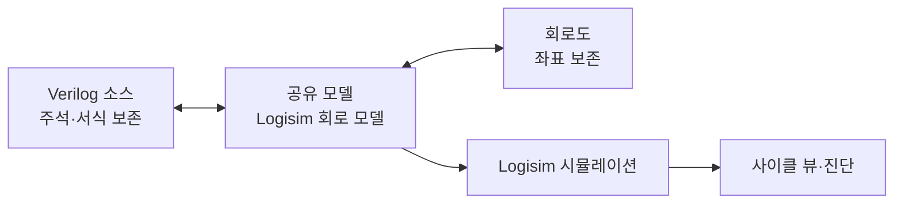

# Hallym Circuit Studio 기획서

2026-09-24 · 김학현 (AIAC Lab, 한림대학교)

> **이번 개발 범위.** 로드맵 0~4단계(9장, 2a·2b·2c·4b 포함)와 11장 편집기 개선 전체를 구현한다. 오류 진단, MIPS 부품, .s 불러오기, 사이클 뷰, 편집기 개선이 여기에 속한다.
> Verilog 연결(7장, 로드맵 5~9단계)은 **구현하지 않는다.** 대신 나중에 붙일 수 있도록 7.0의 설계 원칙을 지킨다.

## 1. 개요

Hallym Circuit Studio는 수업용 Logisim 2.7.1을 포크한 Windows 설치형 Micro-architecture 실습도구다. 학생이 single-cycle MIPS를 설계하다 막히는 곳을 도구가 짚어준다. 나중에는 같은 설계를 Verilog로 읽고 쓰게 한다.

**배경.** 수업은 한 학기 동안 Logisim 2.7.1로 single-cycle MIPS를 설계한다. 2.7.1은 2011년에 개발이 중단됐다. Verilog는 학생들이 작성을 어려워해 수업에서 쓰지 않는다.

**해결할 문제.**

- 작동하지 않는 회로의 원인을 알려주지 않는다. E만 보여주거나, 클럭이 빠진 레지스터처럼 아무 표시 없이 동작하지 않는다.
- 클럭에 따른 동작이 한눈에 안 보인다. 학생은 클럭을 손으로 누르거나 probe를 하나씩 보면서, 지금이 몇 번째 명령어인지 머릿속으로 맞춰야 한다.
- 프로그램을 명령어 메모리 RAM에 손으로 입력한다. 기본 RAM·ROM은 주소가 24비트까지라, MIPS의 32비트 주소를 그대로 쓸 수도 없다.
- 편집 화면이 2011년 그대로다. 탭이 없고, 확대·축소와 이동이 불편하고, 우클릭 메뉴가 빈약하고, 부품을 찾으려면 트리를 뒤져야 하고, 선이 부품을 따라오지 않는다. 큰 datapath에서 신호가 어디서 와서 어디로 가는지 보기 어렵다.
- 회로로는 설계할 수 있지만, 같은 회로를 Verilog로 쓰지 못한다(향후 범위).

**설계 원칙.**

- **도구는 부품 라이브러리와 편집 도구를 주고, "동작하지 않는 회로"만 알린다.** 동작하지 않는 회로는 값이 정의되지 않았거나(E, X, 진동) 구조상 동작할 수 없는 회로다.
- **"동작하지만 잘못된 회로"는 판단하지도, 고치지도, 정답과 비교하지도 않는다.** 모든 선에 0/1이 흐르는데 결과만 틀린 경우다. 학생이 고친다.
- **도구는 학생 설계에 관여하지 않는다.** 예: 분기 목적지 계산은 학생 데이터패스의 몫이고, 도구는 QtSpim 기계어를 메모리에 올려 주소에 해당하는 워드를 내보낼 뿐이다(D-010).
- Logisim 시뮬레이션 엔진은 수정하지 않는다. 새 기능은 그 위에 얹는 층으로 만든다.
- 이 원칙이 4장 진단과 11장 편집기 개선의 기준이다. 편집 도움(포트 변경 영향 미리 보기, 프로그램이 쓰는 명령어 목록, 영향 경로 보기)은 정오 판단이 아니라서 둔다.

**목표.**

1. 기존 .circ 과제 파일을 그대로 열고, 채점 결과가 바뀌지 않는다.
2. 작동하지 않는 회로는 원인 한 곳을, 학생이 붙인 이름과 위치로 알려준다.
3. 사이클마다 명령어, 선택한 신호, 레지스터 변화를 한 화면에서 보고, 지난 사이클로 돌아간다.
4. MIPS 32비트 주소를 그대로 쓰는 Instruction Memory, Data Memory, Stack, Console 부품을 제공한다. Hallym MIPS Simulator에서 작성한 .s 파일을 그 메모리에 불러온다.
5. 탭, 확대·축소, 대상별 우클릭 메뉴, 검색, 따라오는 배선, 영향 경로로 요즘 편집기처럼 편집한다. 파일은 원조 2.7.1 형식 그대로다(11장).
6. (향후) 회로를 Verilog로 읽고, 고치고, 쓴다.
7. 서버 없이 Windows 설치 파일 하나로 끝난다.

**두 도구의 관계.** 같은 `lw` 하나를 두 층에서 본다. [Hallym MIPS Simulator](https://github.com/ars2323/hallym-mips-simulator)에서 `lw`가 레지스터를 바꾸는 것을 보고, 이 도구에서 그 `lw`가 데이터패스의 어느 선을 타고 레지스터 파일에 도착하는지 본다.

| | Hallym MIPS Simulator | Hallym Circuit Studio |
| --- | --- | --- |
| 수업 내 역할 | Computer Architecture 실습 (ISA) | Micro-architecture 실습 |
| 학생이 보는 것 | 명령어, 레지스터, 메모리 | 데이터패스, 제어 신호, 사이클 |
| 베이스 | QtSpim 9.1.24, C++/Qt | Logisim 2.7.1, Java/Swing |
| 연결 | .s 파일을 작성·실행 | 같은 .s 파일을 불러와 학생 회로에서 실행 |

## 2. 기존 도구와 차별점

기존 도구는 증상(E, 선 색)을 보여주고, 회로를 HDL로 내보낼 수는 있다. 하지만 원인 진단과 MIPS 수업에 맞춘 화면은 없다.

| 도구 | 형태 | 되는 것 | 빈 곳 |
| --- | --- | --- | --- |
| [Logisim-evolution](https://github.com/logisim-evolution/logisim-evolution/releases/tag/v4.1.0) | Java 데스크톱, GPL-3.0, v4.1.0 (2026년 2월) | HDL 생성(FPGA용), chronogram, 레지스터 State 탭, 순차 회로 TestVector | 오류 원인 설명 없음. 내보낸 HDL은 합성용이라 학습용으로 읽기 어려움. 명령어와 사이클 연결 없음 |
| [Digital](https://github.com/hneemann/Digital) | Java 데스크톱 | Verilog/VHDL 내보내기, 테스트 케이스, [테스트 결과 클릭 시 그 상태로 이동](https://github.com/hneemann/Digital/releases), iverilog Verilog 컴포넌트 | 수업 .circ와 호환 안 됨. Verilog 컴포넌트는 블랙박스 |
| [CircuitVerse](https://blog.circuitverse.org/posts/vivek_kumar_gsoc2025_finalreport/) | 웹 | Verilog → Yosys → 회로, 실험적 Verilog 내보내기 | 서버 필요. 가져온 회로는 블랙박스 서브회로. 역방향 없음 |
| DigitalJS | 웹 | Verilog → Yosys 합성 → 회로도, 실시간 파형 | 합성 결과라 학생 코드와 모양이 다름. 역방향 없음 |

**Hallym Circuit Studio만의 것.**

- 작동하지 않는 회로에서 원인 한 곳을 짚는 진단 (4장)
- MIPS 명령어 단위로 묶인 사이클 뷰와 뒤로 가기 (5장)
- 32비트 주소 MIPS 메모리 부품과 Hallym MIPS의 .s 바로 불러오기 (6장)
- 2.7.1 파일 형식을 그대로 둔 채 바꾼 편집 경험: 파일·회로 탭과 탭 간 라이브러리, 대상별 우클릭 메뉴, 한글 별칭 부품 검색, 따라오는 배선, 영향 경로 강조 (11장)
- (향후) 주석과 서식을 보존하는 회로 ↔ structural Verilog 양방향 편집 (7장)
- 학생들이 지금 쓰는 2.7.1과 같은 엔진, 기존 .circ 과제 완전 호환

evolution이나 Digital로 갈아타지 않고 Logisim 2.7.1을 포크하는 이유는 호환성이다. 수업 과제와 학생 제출물이 모두 2.7.1 .circ이고, 채점도 2.7.1 결과를 기준으로 한다. evolution은 4.0에서 시뮬레이션 엔진을 다시 설계했고, evolution에서 저장한 파일은 2.7.1에서 열리지 않는다.

## 3. 제품 결정사항

Logisim 2.7.1을 포크하되 시뮬레이션 엔진은 손대지 않고, Hallym MIPS Simulator와 같은 방식으로 배포한다.

| 항목 | 결정 | 이유 |
| --- | --- | --- |
| 이름 | Hallym Circuit Studio. 저장소 `hallym-circuit-studio` | Hallym MIPS Simulator와 한 제품군 |
| 베이스 | Logisim 2.7.1 포크 | 학생들이 지금 쓰는 버전. 기존 과제와 제출물이 그대로 열리고 채점 결과가 같다. 연결 규칙 검증(부록 A)도 2.7.1 기준 |
| 엔진 | 시뮬레이션 코어 수정 금지. 표준 2.7.1 jar와 결과를 비교하는 회귀 테스트를 매 push마다 실행 | 채점 연속성. Hallym MIPS가 SPIM 코어를 수정하지 않는 것과 같은 원칙 |
| 파일 형식 | 2.7.1 .circ 형식 유지 | 새 부품을 쓰지 않은 파일은 원조 2.7.1에서도 열려, 전환기에 두 도구를 섞어 써도 된다 |
| 새 부품 | MIPS 메모리, Console, 다중 진법 Probe는 2.7.1의 JAR 라이브러리 방식으로 추가 | 코어를 건드리지 않고 부품을 더하는 2.7.1의 공식 확장 방식. 원조 2.7.1에서도 같은 JAR을 불러오면 부품을 쓸 수 있는지 0단계에서 확인 |
| 플랫폼 | Windows 64비트. zip(관리자 권한 불필요) + MSI | 실습실 환경, Hallym MIPS와 같은 배포 방식 |
| 서버 | 없음 | 모든 처리를 로컬에서 실행 |
| 프로그램 입력 | QtSpim에서 문제없이 어셈블되는 .s | Hallym MIPS에서 작성한 파일을 그대로 사용. 두 도구의 유일한 접점 |
| 어셈블 | SPIM 코어(수정하지 않은 `CPU/`)로 만든 명령줄 도구 | QtSpim과 기계어가 비트 단위로 같음 (6.7) |
| 편집기 | 2.7.1 편집 화면 위에 탭·확대·우클릭·검색·배선·영향 경로 층을 얹는다. 툴바·마우스 매핑·라벨 글꼴 같은 .circ 안의 값은 바꾸지 않고 사용자 설정은 앱 환경설정에 둔다 | 학생이 매 시간 쓰는 화면이다. 파일은 원조와 섞어 써야 하므로 표시 층에서만 바꾼다(11장) |
| 개발 언어 | Java, Swing + FlatLaf. 2011년 코드를 최신 JDK로 빌드되게 정리. Electron은 쓰지 않음 | 2.7.1은 구형 Java 기준 코드다. FlatLaf로 요즘 모양과 디자인 토큰을 입힌다. Electron은 편집기와 시뮬레이터를 다시 만들어야 해서 2.7.1을 고른 이유가 사라지고, JAR 라이브러리(트랙 A)도 못 만든다 |
| 디자인 | Hallym MIPS의 디자인 토큰(`docs/design/tokens.md`)을 Swing으로 이식 | 두 도구가 한 제품군으로 보이고, 레지스터 패널이 같은 모양이 됨 |
| 글꼴 | Pretendard (SIL OFL 1.1) | Hallym MIPS와 동일 |
| UI 언어 | 한국어, 영어. 첫 실행 튜토리얼 | Hallym MIPS와 동일 |
| 라이선스 | GPL | 포크 원본을 따름. 배포 시 소스 공개. SPIM(BSD)은 별도 실행 파일로만 번들해 코드가 섞이지 않음 |

**호환성 주의.** 새 부품을 쓴 .circ는 그 JAR 라이브러리가 없는 원조 2.7.1에서 열리지 않는다. 수업 전체가 새 도구로 넘어가는 시점을 교수님과 정해야 한다.

**학교 식별요소.**

- **로고:** 심벌마크, 로고타입, 엠블럼, 시그니처. 원형 그대로 쓰고 크기와 여백만 조절한다. 다시 그리거나 색을 바꾸지 않는다. 학교 UI 규정에 따르며 상업적 사용은 금지다. Hallym MIPS의 선례를 따른다.
- **캐릭터 하람&하리:** 기본형과 응용동작 20종이 있다. 첫 실행 튜토리얼, 정보 창, 빈 화면 안내처럼 친근함이 필요한 곳에만 아껴 쓴다. 가이드라인에 따라 요소 추가, 선 변경, 비율·색 변경은 하지 않는다. 복잡하거나 비슷한 색의 배경 위에 두지 않고, 최소 여백을 지킨다.

## 4. 오류 진단

도구는 값이 정의되지 않았거나(E, X, 진동) 구조상 동작할 수 없는 회로만 알린다. 모든 선에 0/1이 흐르는데 결과만 틀리면 침묵한다.

### 4.1 정적 검사와 동적 검사

값만 보면 부족하다. 클럭이 안 붙은 레지스터는 E도 X도 내지 않고 0을 유지한다. 그래서 두 층으로 검사한다.

- **정적 검사:** 연결 구조만 보고 시뮬레이션 전에 찾는다. 편집을 멈추면 자동으로 돌고 진단 패널에 목록이 뜬다.
- **동적 검사:** 시뮬레이션 중 값을 보고 찾는다. E·X가 처음 생긴 사이클에 알린다.

### 4.2 검사 목록

| 상황 | 지금 Logisim이 보여주는 것 | 도구가 알려줄 것 | 검사 |
| --- | --- | --- | --- |
| 레지스터·RAM 클럭 미연결 | 없음. 값이 안 바뀔 뿐 | 어느 레지스터의 클럭이 비었는지 | 정적 |
| 두 출력이 한 선을 구동(합선) | 빨간 선, E | 충돌하는 두 부품의 이름과 위치 | 정적 |
| 비트 폭 불일치 | 주황 선 | 양쪽 부품과 폭 (예: 32비트 ↔ 5비트) | 정적 |
| 연결 안 된 입력 | 파란 선. `gateUndefined=ignore`면 게이트가 조용히 무시 | 어느 부품의 몇 번 입력인지 | 정적 |
| 짝 없는 터널 | 파란 선 | 터널 이름과 비슷한 이름 후보 (예: RegDst ↔ RegDest) | 정적 |
| 서브회로 포트 미연결 | 파란 선 또는 없음 | 서브회로 이름과 포트 이름 | 정적 |
| 조합 루프 | 진동 경고 후 멈춤 | 루프를 이루는 경로 하이라이트 | 정적 + 동적 |
| E·X가 여러 곳에 퍼짐 | 곳곳에 E | 처음 생긴 지점 하나 | 동적 |
| X가 레지스터·메모리에 기록됨 | 몇 사이클 뒤 엉뚱한 곳에서 X | 기록된 사이클과 그 원인 | 동적 |

MIPS 부품(6.2)을 쓰면 어느 메모리 영역에도 없는 주소 접근(Data와 Stack 사이 포함), 워드 정렬이 안 된 주소, 스택 한계 초과, Data·Stack 영역 겹침, 떠 있는 MemWrite·MemRead·Syscall도 잡는다. 이 목록은 초안이다. 지난 학기 조교 질문과 제출물에서 자주 나온 "작동 안 함" 사례로 확정한다.

**알리지 않는 것(1장 설계 원칙).** 동작은 하는 회로의 정오 판단, 정답(SPIM 실행 결과)과의 비교, 위험해 보이는 설계(게이트로 만든 클럭 등) 경고. 선이 남의 포트 위를 지나 연결된 것도 진단이 아니다. 연결점을 크게 그려 화면에서 보이게만 하고(11.9), 그 때문에 생긴 합선은 기존 합선 진단이 잡는다.

### 4.3 E·X 출처 추적

E·X가 보이는 선에서 입력 쪽으로 거슬러 올라가, 처음 생긴 한 곳에서 멈춘다.

1. 현재 선을 구동하는 부품의 입력 중 E·X인 것을 따라간다.
2. 입력은 모두 정의됐는데 출력이 E·X인 부품, 구동자가 없는 선, 구동자가 둘인 선에서 멈춘다. 그곳이 원인이다.
3. 서브회로 경계를 만나면 안으로 들어간다.
4. 레지스터를 만나면 시간을 거슬러, X가 기록된 사이클의 입력에서 계속한다. 이 단계는 5장의 기록 엔진을 쓴다.

### 4.4 메시지 원칙

- **원인 한 곳만 말한다.** E가 스무 곳에 보여도 처음 생긴 곳 하나만 말한다.
- **학생이 붙인 이름으로 말한다.** "Register @ (340,120)"이 아니라 "datapath › PC". 라벨이 없으면 서브회로 경로와 부품 종류로 대신한다.
- **사실과 위치까지만 말한다.** 고치는 방법은 말하지 않는다.
- **클릭하면 간다.** 메시지를 클릭하면 해당 서브회로로 들어가 부품과 선을 하이라이트한다. 동적 진단은 사이클 뷰도 그 사이클로 옮긴다.
- **막지 않는다.** 팝업 대신 진단 패널과 회로도 위 표시로 알린다. 학생은 계속 편집할 수 있다.

메시지 예시:

- `datapath › PC` 레지스터의 클럭 입력이 연결되지 않아 값이 바뀌지 않습니다.
- `datapath` 의 한 선을 `ALU` 출력과 `SignExt` 출력이 함께 구동합니다.
- 사이클 4에 `RegFile` 에 X가 기록됐습니다. 원인: `control › RegWrite` 출력이 정의되지 않았습니다.

## 5. 사이클 뷰

회로도 아래에 사이클 뷰를 둔다. 열 하나가 클럭 한 사이클이고, 명령어·선택한 신호·레지스터 변화를 한 화면에 보여준다.

### 5.1 화면 구성

- **조작 막대:** 이전 사이클, 다음 사이클, 여기까지 실행, 현재 사이클 번호.
- **사이클 표:** 열은 사이클, 머리는 PC와 명령어다. 명령어는 학생이 쓴 .s의 원래 줄(라벨·주석 포함)이고, .s가 없으면 디스어셈블 결과다. 줄은 선택한 신호다. 1비트는 파형, 버스는 값으로 보인다.
- **레지스터 패널:** PC, 레지스터 파일, 메모리 쓰기. 이번 사이클에 바뀐 값을 강조한다. 값은 16진수·10진수·2진수를 한 줄에 함께 보여준다. 레지스터마다 주 표시 진법을 클릭 한 번으로 바꾼다. 10진수는 부호 있음·없음을 고르고, 2진수는 4비트씩 끊어 보인다. Hallym MIPS의 레지스터 창과 같은 모양이다(역할별 묶음, `$name`과 번호, 16진수와 10진수, 바뀐 값은 청록 글자 `#00736F`와 옅은 청록 배경 `#E6F6F5`. 고정폭 열의 정렬이 깨지므로 굵기는 쓰지 않는다). 트랙 A에서는 같은 표시를 하는 다중 진법 Probe 부품을 라이브러리에 넣는다.

### 5.2 동작

- **열 클릭:** 회로도 전체(선 색, 버스 값)가 그 사이클 값으로 바뀐다. 서브회로 안으로 들어가도 시점이 유지된다.
- **뒤로 가기:** 기록을 재생한다. 지난 사이클에서 입력을 바꾸거나 회로를 고치면, 그 뒤 기록을 버리고 그 시점부터 다시 진행한다.
- **여기까지 실행:** 조건은 PC 값, 특정 레지스터의 변화, 특정 명령어 종류(예: 다음 `beq`), E·X 발생이다. 무한 루프에 대비해 최대 사이클 수를 둔다.
- **신호 추가:** 회로도에서 선을 클릭하면 줄이 추가된다. 버스는 한 줄의 16진수 값이고 필요할 때만 비트로 펼친다. 회로도의 어느 선이든 마우스를 올리면 16진수·10진수·2진수를 함께 보여준다.
- **명령어 클릭:** Hallym MIPS의 Instruction Inspector처럼 32비트를 필드별 색으로 펼친다. 같은 색을 데이터패스의 선에도 칠한다. 예를 들어 `rs` 필드 색이 Read register 1로 가는 선에 칠해진다.

### 5.3 PC·명령어·레지스터 파일 찾기

- **PC와 명령어:** Instruction Memory(6.2), 또는 .s를 불러올 때 고른 명령어 메모리의 주소 입력이 PC, 데이터 출력이 명령어다. 따로 지정할 필요가 없다.
- **레지스터 파일:** 학생이 만든 서브회로라 자동으로 찾기 어렵다. 서브회로를 우클릭해 "레지스터 파일로 표시"하거나 조교가 과제 템플릿에 지정한다.
- **지정이 없으면:** 회로 안의 모든 레지스터와 RAM을 서브회로 경로별로 나열한다.

### 5.4 기록 엔진

- 매 스텝 모든 넷 값을 변화분만 기록한다. 어떤 신호가 필요할지 미리 알 수 없기 때문이다.
- 사이클 뷰와 동적 진단(4.3)이 같은 기록을 쓴다.
- 보관할 최대 사이클 수는 과제 회로로 메모리를 측정한 뒤 정한다.
- 2.7.1에는 chronogram이 없으므로 직접 만든다. 신호 값을 기록하는 구조는 2.7.1의 Logging 기능(Simulate › Logging)을 참고한다.

## 6. MIPS 부품과 .s 불러오기

MIPS 32비트 주소를 그대로 쓰는 Instruction Memory, Data Memory, Stack, Console 부품을 제공한다. Hallym MIPS에서 작성한 .s를 골라 이 메모리에 넣는다. Hallym MIPS는 수정하지 않고, 두 도구의 접점은 .s 파일 하나다.

### 6.1 기본 RAM·ROM의 한계

- Logisim 2.7의 [RAM](https://www.cburch.com/logisim/docs/2.7/en/html/libs/mem/ram.html)과 [ROM](https://www.cburch.com/logisim/docs/2.7/en/html/libs/mem/rom.html)은 주소 24비트(16,777,216개), 데이터 32비트까지다. MIPS의 32비트 주소를 그대로 쓸 수 없어, 학생이 주소의 일부 비트만 잘라 연결한다.
- 잘린 주소는 조용히 겹친다. 잘못된 주소로 `lw`·`sw`를 해도 다른 칸에 접근할 뿐 아무 표시가 없다.
- RAM 내용은 .circ에 저장되지 않는다. ROM만 내용이 속성으로 파일에 저장된다. 프로그램을 RAM에 넣으면 파일을 다시 열 때마다 새로 넣어야 한다.
- RAM의 `sel`, `ld`, `str` 입력은 떠 있으면 1로 취급된다. 연결을 빠뜨려도 오류 없이 동작한다.
- 기본 부품은 고치지 않는다. 기존 과제 호환과 코어 불변 원칙(3장) 때문이다. 대신 아래 새 부품이 32비트 주소를 지원한다.

### 6.2 MIPS 메모리 부품

| 부품 | 포트 | 기본 주소 영역 | 초기 내용 |
| --- | --- | --- | --- |
| Instruction Memory | 입력 `Addr`(32), 출력 `Instr`(32). 클럭 없음, 읽기 전용 | `0x00400000`부터 (.text) | .s의 .text |
| Data Memory | 입력 `Addr`(32), `WriteData`(32), `MemWrite`, `MemRead`, clk. 출력 `ReadData`(32) | `0x10010000`부터 높은 주소 쪽으로, 한계 1MB (.data) | .s의 .data |
| Stack | Data Memory와 같음 | 맨 위 워드 `0x7FFFFFFC`부터 낮은 주소 쪽으로, 한계 1MB | 비어 있음 |

기본 주소는 SPIM과 같다. Hallym MIPS에서 본 주소가 회로에서도 그대로 보인다. Stack은 당분간 Data Memory와 별도 부품으로 두고, 나중에 합친다. QtSpim 기반 시뮬레이터는 .bss와 힙을 쓰지 않으므로 그 영역의 부품은 두지 않는다. .data 끝과 스택 사이 주소에 접근하면 어느 영역에도 없는 주소로 진단된다.

**공통 동작.**

- **32비트 byte 주소를 그대로 받는다.** PC와 ALU 결과를 스플리터 없이 바로 연결한다. 워드 접근은 하위 2비트를 쓰지 않는다.
- **희소 저장.** 쓴 페이지만 메모리를 차지한다. 32비트 주소 공간을 써도 크기 부담이 없다.
- **영역 밖 주소에서는 출력하지 않는다.** Data Memory와 Stack의 `ReadData`를 한 선에 이어도 되고, 주소가 속한 쪽만 값을 낸다. 쓰기도 주소가 속한 쪽에만 일어난다. 어느 영역에도 없는 주소는 진단이 알려준다.
- **교재 single-cycle과 같은 타이밍.** 읽기는 조합(클럭 없음), 쓰기는 clk 상승 에지에 `MemWrite`가 1일 때다.
- **떠 있는 제어 입력은 1로 취급하지 않는다.** 쓰기를 하지 않고 진단으로 알린다. 기본 RAM과 다른 점이다.
- **워드 접근만.** 바이트·하프워드 접근(`lb`, `sb`, `lh`)은 지원하지 않는다. 워드 정렬이 안 된 주소는 진단으로 알린다.
- **속성.** 시작 주소와 영역 크기를 바꿀 수 있다.
- **자라는 방향과 한계.** Data는 시작 주소에서 높은 주소 쪽으로, Stack은 맨 위 워드에서 낮은 주소 쪽으로 자란다. 한계(기본 1MB)는 속성으로 바꾼다. 희소 저장이라 한계가 커도 쓴 페이지만 메모리를 쓴다.
- **동작하지 않는 경우만 알린다.** 어느 메모리 영역에도 없는 주소(두 영역 사이 포함), 워드 정렬 안 된 주소, Stack 한계 바로 아래(한계 폭 안) 주소 접근은 "스택 사용량이 한계(1MB)를 넘었습니다", Data·Stack 영역 겹침, 떠 있는 제어 입력. 사실만 말하고 원인·해결책은 추측하지 않는다.
- **모양.** 부품 안에는 영역, Stack의 현재·최대 깊이(접근한 주소 기준), 현재 주소의 워드가 보인다. 전체 내용은 사이클 뷰의 메모리 패널에서 본다. Data는 낮은 주소부터 .data 라벨과 함께, Stack은 높은 주소가 위이고 `$sp` 화살표와 현재 깊이·최대 깊이를 함께 보인다(Hallym MIPS의 Data·Stack 창과 같은 모양, 3단계).
- **저장.** Instruction Memory는 .s 경로와 기계어 스냅샷을 .circ에 저장해, .s가 없어도 파일이 동작한다. Data Memory와 Stack은 실행 중 쓴 값을 저장하지 않고, 리셋하면 .data 초기값으로 돌아간다.
- **Verilog(향후).** 표준 라이브러리 모듈 `lg_imem`, `lg_dmem`에 대응하고, 초기 내용은 `$readmemh`로 내보낸다(7.7).

### 6.3 불러오기 흐름


MIPS 메모리 부품을 쓰면 .s 파일만 고르면 끝난다. .text는 Instruction Memory로, .data는 Data Memory로 가고, 주소는 SPIM 그대로라 확인할 것이 없다. 같은 부품이 둘 이상일 때만 어느 쪽인지 묻는다. 기본 RAM·ROM을 쓰는 기존 과제만 6.4의 메모리 선택과 6.5의 주소 확인을 거친다.

### 6.4 메모리 선택 (기본 RAM·ROM을 쓸 때)

- 회로 안의 모든 RAM과 ROM을 서브회로 경로와 크기와 함께 보여준다. 예: `datapath › InstrMem (RAM, 8비트 주소 × 32비트)`.
- 목록에서 고르거나 회로도에서 해당 부품을 클릭한다. `.text`와 `.data`를 각각 다른 메모리에 지정할 수 있다.
- 조교가 과제 템플릿에 미리 지정해 두면, 학생은 파일만 고른다.

### 6.5 주소 규칙

- **MIPS 메모리 부품:** SPIM 주소 그대로 어셈블한다. 재배치가 없다. PC를 `0x00400000`에서 시작시키는 것은 학생이 회로에서 맞춘다.
- **기본 RAM·ROM:** 워드를 0번 칸부터 순서대로 넣는다. 기계어는 SPIM 주소 기준이라, 학생 회로가 주소 하위 비트만 쓰면 `j`의 목적지와 `.data` 라벨 주소가 맞지 않을 수 있다. 기존 과제용 호환 경로이고, 새 과제는 MIPS 메모리 부품을 쓴다.
- **시작 코드 없음:** QtSpim은 기본 설정에서 예외 처리기 파일의 시작 코드를 `0x00400000`에 먼저 올리고, 그 코드가 `main`을 호출한다. 이 도구는 시작 코드와 커널 세그먼트(`.ktext`, `.kdata`)를 올리지 않고, 사용자 `.text`(main부터)를 `0x00400000`부터 올린다. 과제는 예외 처리기 불러오기를 끈 설정으로 운영해 두 도구의 주소를 같게 한다. Hallym MIPS에서 이 설정이 어떻게 보이는지 0단계에서 확인한다.
- **`$sp` 초기값:** 학생 몫이다. SPIM은 `$sp`를 미리 설정하지만 학생 레지스터 파일은 0에서 시작하므로, 프로그램이나 회로에서 초기화한다. 빠뜨리면 어느 메모리 영역에도 없는 주소 접근으로 진단된다.

### 6.6 올리는 범위

- QtSpim(Hallym MIPS)에서 문제없이 어셈블되는 .s는 그대로 올린다. 의사 명령어(`li`, `la`, `move` 등)는 SPIM과 똑같이 실제 명령어로 펼쳐 올린다. `syscall`도 기계어 그대로 올린다.
- .text는 Instruction Memory, .data는 Data Memory에 올린다. Stack은 비워 둔다. .bss, 힙, 커널 세그먼트는 올리지 않는다.
- 그 뒤는 학생의 설계다. 클럭이 뛰면 세 메모리는 실제 RAM처럼 동작한다(6.2). 학생 데이터패스가 그 명령어를 실행하는지는 도구가 검사하지 않는다.
- 대신 불러온 뒤 프로그램이 실제로 쓰는 명령어 목록을 보여준다(예: `lui`, `ori`, `lw`, `add`, `beq`). 데이터패스가 무엇을 지원해야 하는지 학생이 알 수 있다.

### 6.7 어셈블러

- QtSpim과 똑같이 어셈블하는 것이 핵심이다. 의사 명령어를 펼치는 방식까지 같아야 하므로, Java로 새로 짜지 않고 SPIM 코어(수정하지 않은 `CPU/`)를 쓴다.
- SPIM 코어로 작은 명령줄 도구를 만들어 .s를 어셈블하고, 텍스트·데이터 세그먼트의 워드와 각 워드의 원래 소스 줄을 출력한다. 새 도구는 이 결과를 읽어 메모리에 올린다. 같은 코어를 쓰므로 결과가 QtSpim과 같다.
- SPIM(BSD)은 별도 실행 파일로 번들하므로 GPL 코드와 섞이지 않는다. Windows 실행 파일은 Hallym MIPS와 같은 CI에서 빌드한다.
- 대안은 Java 어셈블러를 새로 짜고 SPIM과 결과가 같은지 테스트하는 것이다. 의사 명령어 전체를 맞춰야 해서 작업량이 크다.
- 같은 .s면 주소와 기계어가 Hallym MIPS와 비트 단위로 같다. 도구는 기계어를 Hallym MIPS의 Instruction Inspector와 같은 모양으로, 2진수 32칸을 필드별 색으로 끊어 보여준다.
- 비트 단위로 같으려면 두 도구의 SPIM 설정(예외 처리기 불러오기, 지연 분기, 의사 명령어)이 같아야 한다. 과제 표준 설정을 하나 정하고, 명령줄 도구도 그 설정으로 돌린다.
- **기계어는 QtSpim 그대로(D-010, 사용자 확정).** 명령줄 도구는 과제 표준 설정(예외 처리기 끔, 지연 분기 끔, 의사 명령어 켬)으로 SPIM 코어가 만든 기계어를 바꾸지 않고 올린다. 인코딩을 고르는 설정은 없다. 분기 목적지 계산은 학생 데이터패스의 몫이다. 참고로 지연 분기를 끈 SPIM은 분기 오프셋을 PC 기준으로 인코딩하고, 교재는 PC+4 기준으로 설명한다.

### 6.8 자동 재로드

- .circ에 .s 경로(상대 경로)와 메모리 지정을 저장한다.
- 시뮬레이션 리셋, 파일 다시 열기, .s 파일 변경 때 다시 로드한다.

### 6.9 Console 부품

프로그램 출력은 레지스터처럼 학생이 회로에 놓고 연결하는 Console 부품으로 보여준다. SPIM 코어는 어셈블만 하고 실행은 학생 회로가 하므로, `syscall`을 처리하는 것도 회로의 일이다.

| 포트 | 폭 | 의미 |
| --- | --- | --- |
| `Syscall` | 1 | 이번 사이클이 `syscall`이면 1. 학생 제어 유닛이 디코드한다 |
| `V0` | 32 | `$v0` 값(syscall 번호) |
| `A0` | 32 | `$a0` 값(출력할 값 또는 문자열 주소) |
| clk | 1 | 상승 에지에 `Syscall`이 1이면 처리 |

**지원하는 syscall.**

| `$v0` | 동작 |
| --- | --- |
| 1 | `print_int`: `A0`를 부호 있는 10진수로 출력 |
| 4 | `print_string`: `A0` 주소부터 0 바이트까지 문자열을 Data Memory·Stack에서 직접 읽어 출력 |
| 11 | `print_char`: `A0`의 하위 8비트를 문자로 출력 |
| 10 | `exit`: 프로그램 끝. 시뮬레이션 클럭을 멈춘다 |

- 그 밖의 번호나 떠 있는 `Syscall`은 처리하지 않고 진단으로 알린다. 입력 syscall(`read_int` 등)은 나중에 더한다.
- `print_string`은 MIPS 메모리 부품의 내용을 바이트 단위로 읽는다. 학생 회로에는 워드 접근만 있어도 된다. 바이트 순서는 SPIM과 같은 리틀 엔디언이다.
- 부품 안에 최근 출력 몇 줄이 보인다(2.7.1의 TTY 부품처럼). 그래서 JAR 라이브러리만 있는 원조 2.7.1에서도 출력을 볼 수 있다.
- 포크에서는 Hallym MIPS처럼 아래쪽에 Console / Messages 두 탭을 둔다. Console은 프로그램 출력, Messages는 진단(4장)이다.
- 학생은 같은 .s를 Hallym MIPS와 자기 CPU에서 돌려 출력이 같은지 스스로 비교한다.

## 7. Verilog 연결 (향후 범위)

> 이 장은 이번 개발에서 **구현하지 않는다.** 7.0의 원칙만 지금 코드에 반영하고, 7.1~7.7은 다음 단계의 설계 기록으로 남긴다.

학생이 이미 만든 MIPS 회로를 발판으로 Verilog를 읽고, 고치고, 쓰게 한다. 테스트벤치는 필요 없다. Verilog로 쓴 부분도 Logisim 회로 안에서 클릭과 .s 프로그램으로 확인한다.

### 7.0 지금 구현에서 지킬 것

- **회로 모델이 중심이다.** 진단, 기록 엔진, 사이클 뷰, MIPS 부품은 GUI가 아니라 Logisim 회로 모델(`Circuit`, `Component`, `Wire`, 넷)을 입력으로 받는다. 나중에 Verilog 뷰가 같은 모델을 보게 된다.
- **이름이 ID다.** 부품 라벨, 서브회로 이름, 터널 이름, 포트 이름을 식별자로 다루는 공용 유틸리티를 둔다. 진단 메시지의 "datapath › PC" 경로 표기와 향후 Verilog 인스턴스·넷 이름이 같은 규칙을 쓴다.
- **부품 종류는 한 곳에서 다룬다.** 부품 종류별 처리(진단 규칙, 표시 방법)를 흩어진 `instanceof` 분기 대신 등록표로 모은다. 향후 Logisim ↔ Verilog 매핑표(7.5)가 같은 등록표에 붙는다.
- **새 부품의 포트 이름을 Verilog 모듈 포트와 맞춘다.** Instruction Memory, Data Memory, Stack, Console의 포트 이름은 `lg_imem`, `lg_dmem`, `lg_console` 모듈 포트로 그대로 쓸 수 있게 정한다.
- **.circ 확장 속성은 한 방식으로.** 도구가 .circ에 저장하는 추가 정보(.s 경로, 레지스터 파일 표시, 관찰 목록)는 하나의 네임스페이스로 모아, 원조 2.7.1이 무시하고 열 수 있게 한다. 향후 좌표·Verilog 메타데이터도 같은 방식을 쓴다.

### 7.1 학습 흐름

| 단계 | 학생이 하는 일 | 필요한 기능 |
| --- | --- | --- |
| 읽기 | 내가 그린 회로의 Verilog를 옆에서 본다. 회로를 고치면 코드가 바뀐다 | 회로 → 사람이 읽을 수 있는 structural Verilog |
| 쓰기 시작 | Control, ALU Control, 레지스터 파일을 Verilog 코드 블록으로 쓴다 | behavioral 코드 블록 |
| 고치기 | 코드의 이름이나 연결을 바꾸면 회로가 바뀐다 | 실시간 양방향 편집, 증분 배선 |
| 쓰기 | 빈 모듈에서 코드를 써서 회로를 만든다 | Verilog → 회로, 자동 배치·배선 |

### 7.2 MIPS 부품별 역할

| 부품 | Verilog 형태 | 역할 |
| --- | --- | --- |
| ALU, 가산기, MUX, 부호 확장 | structural, `assign` | 읽기: 내 회로가 이런 코드구나 |
| Control, ALU Control | `case` 문 | 쓰기 동기: 진리표를 게이트로 그리는 것보다 쉬운 첫 순간 |
| 레지스터 파일 | `reg` 배열 | 거대한 회로가 코드 몇 줄이 됨 |
| 최상위 데이터패스 | 모듈 인스턴스 | 양방향 편집의 본무대 |

### 7.3 공유 모델

Verilog도 회로도도 원본이 아니다. 둘 다 Logisim 회로 모델이라는 하나의 공유 모델을 보여주는 뷰다.



편집은 항상 공유 모델을 거친다. 한쪽 변경은 모델 변경분으로 바뀌고, 그 변경분만 반대쪽에 반영된다.

- Logisim 2.7.1의 `Circuit`, `Component`, `Wire`를 그대로 쓴다. 서브회로 하나가 Verilog `module` 하나다.
- 새 부품은 하나, Verilog 코드 블록뿐이다. 2.7.1의 JAR 라이브러리 방식으로 추가한다(3장).

### 7.4 코드 블록

- `always`, `assign` 블록은 게이트로 풀지 않고 회로도에 박스 하나로 넣는다. 포트는 코드가 읽는 신호와 쓰는 신호에서 자동 추출한다.
- 더블클릭하면 코드 편집기가 열린다. 합성 결과 미리보기는 읽기 전용이다.
- 시뮬레이션은 Yosys로 백그라운드에서 게이트 합성한 뒤 Logisim 엔진 안에서 돌린다. 화면에는 코드 박스만 보인다.
- 합성 가능한 서브셋만 허용한다: `assign`, `always @(*)`, `always @(posedge clk)`, `if`, `case`, 산술·논리 연산. `#delay`, `initial`, `$display`는 오류로 표시하고 그 블록은 실행하지 않는다.

### 7.5 structural 양방향 편집

- **좌표 보존:** .v로 내보낼 때 Verilog-2001 attribute에 좌표를 넣는다. iverilog와 Yosys는 이를 무시한다. 좌표가 없는 새 인스턴스는 연결된 이웃 근처에 자동 배치한다(부록 A).

```verilog
(* lg_pos = "120,80" *)
full_adder fa0 (.a(a[0]), .b(b[0]), .cin(c0), .s(s[0]), .cout(c1));
```

- **재생성 대신 패치:** Verilog 파싱은 ANTLR(grammars-v4 Verilog 문법)를 쓴다. 회로도 변경은 `TokenStreamRewriter`로 해당 토큰만 고친다. 주석, 공백, 코드 순서가 그대로 남는다.
- **대응 관계:** 인스턴스명과 넷 이름이 ID다. 이름 없이 그은 선은 `w_1`, `w_2`처럼 자동 이름을 받는다.
- **예외:** 문법 오류 중에는 회로도를 마지막 정상 상태로 멈추고 오류 위치만 표시한다. `generate`, `parameter`는 펼친 결과를 읽기 전용으로 보여준다. 동시 편집은 포커스가 있는 쪽이 편집권을 가진다.

| Logisim | Verilog |
| --- | --- |
| AND/OR/NOT 등 게이트 | 게이트 프리미티브 `and`, `or`, `not` |
| 서브회로 | 모듈 인스턴스 |
| 스플리터 | 비트 슬라이스 `a[3:0]`, 연결 `{a, b}` |
| 터널 | 같은 이름의 넷 |
| 상수 | `4'b0000` 같은 리터럴 |
| 핀(입력/출력) | `input` / `output` 포트 |
| MUX, 레지스터, RAM 등 내장 부품 | 표준 라이브러리 모듈 (예: `lg_mux #(.WIDTH(32))`) |

이 표는 실제 MIPS 과제에 쓰이는 부품 목록을 뽑아 확정한다.

### 7.6 초보자 실수가 회로에서 보인다

| 실수 | 코드에서는 | 회로에서는 |
| --- | --- | --- |
| 넷 이름 오타 (`carry` → `cary`) | 암묵적 1비트 wire가 조용히 생김 | 어디에도 안 이어진 선. 4장 진단이 연결 안 된 입력으로 알림 |
| 위치 기반 포트 순서 틀림 | 문법상 정상 | 입력과 출력이 뒤바뀐 선 |
| 비트 폭 불일치 | 경고 한 줄 또는 무시 | 폭 불일치 진단 |
| 모듈 인스턴스 누락 | 컴파일은 됨 | 떠 있는 출력 핀 |

### 7.7 테스트벤치와 다음 과목

기본은 테스트벤치 없이 회로 안에서 확인한다. 선택 기능으로 전체 MIPS를 .v로 내보내면서, 불러온 .s를 `$readmemh`용 파일로, 간단한 테스트벤치를 자동으로 함께 만든다. iverilog로 바로 돌려볼 수 있어 다음 과목으로 가는 다리가 된다.

## 8. 배포와 개발 환경

JRE와 SPIM 명령줄 도구를 포함한 zip과 MSI 하나로 배포한다. 학생 PC에 따로 설치할 것이 없다.

### 8.1 배포

- **패키징:** JDK의 jpackage로 JRE 포함 패키지를 만든다. zip은 관리자 권한 없이 풀어서 실행한다.
- **번들:** .s 어셈블용 SPIM 명령줄 도구의 Windows 바이너리를 설치 폴더에 넣고 상대 경로로 호출한다. 시스템 PATH는 건드리지 않는다. (향후) 코드 블록용 Yosys도 같은 방식으로 넣는다.
- **라이선스:** SPIM은 BSD다. 폰트는 Hallym MIPS와 같은 Pretendard(SIL OFL 1.1)를 쓴다. 각 라이선스 파일을 설치 폴더에 포함한다.
- **트랙 A 배포:** MIPS 부품 JAR 라이브러리와 SPIM 명령줄 도구를 묶은 zip을 따로 배포한다. 원조 2.7.1에서 Project › Load Library › JAR Library로 불러 쓴다.
- **업데이트:** 학기 중 버그 수정은 새 버전 배포로 처리한다. 자동 업데이트는 범위 밖이다.

### 8.2 개발 환경

- 개발과 테스트는 Linux에서 한다.
- jpackage는 실행 중인 OS용 패키지만 만든다. Windows 패키지는 GitHub Actions의 Windows 러너에서 빌드하고, SPIM 도구의 Windows 바이너리도 그 단계에서 넣는다.
- 경로 구분자, 한글 폰트, 설치 경로 권한은 배포 전 실제 실습실 PC에서 확인한다.

### 8.3 테스트

| 테스트 | 내용 | 통과 기준 |
| --- | --- | --- |
| 엔진 회귀 | 기존 과제 .circ 세트를 표준 2.7.1 jar와 포크에서 같은 입력으로 실행 | 모든 넷 값 일치 |
| 진단 | 알려진 오류를 심은 "고장 회로 모음"과 정상 과제 회로 | 고장 회로는 기대 메시지, 정상 회로는 메시지 0건 |
| 어셈블 일치 | 예제 .s 세트를 새 도구에 올린 결과와 Hallym MIPS(SPIM)에 올린 결과를 비교 | 주소·기계어 일치 |
| MIPS 부품 | 참조 single-cycle MIPS 회로로 예제 .s 실행 | 레지스터·메모리·Console 출력이 SPIM 실행 결과와 일치 |
| (향후) Verilog 왕복 | 과제 .circ → .v → .circ | 연결 불일치 0건. 꺾임·교차·총 길이 추적 |
| (향후) 연결 규칙 | `rules_test*.circ` (부록 A) | 예측한 연결 결과와 일치 |

매 push마다 엔진 회귀, 진단, 어셈블 일치, MIPS 부품 테스트를 돌린다. 고장 회로 모음은 지난 학기 실제 사례에서 만든다.

## 9. 개발 로드맵

두 트랙으로 간다. 트랙 A(1단계)는 2.7.1 jar에 대고 만드는 JAR 라이브러리라 포크 없이 바로 시작하고 배포할 수 있다. 트랙 B(2단계부터)는 2.7.1 소스를 포크해 UI를 바꾼다. 단계가 끝날 때마다 수업에 쓸 수 있는 상태가 된다.

| 단계 | 내용 | 끝나면 할 수 있는 것 | 이번 범위 |
| --- | --- | --- | --- |
| 0. 기반 | 2.7.1 jar·소스 확보, JAR 라이브러리 방식 확인, SPIM 명령줄 도구 빌드, 과제 부품 목록 정리, Hallym MIPS 과제 표준 설정(예외 처리기, 지연 분기) 확정 | 두 트랙의 준비 완료 | 예 |
| 1. MIPS 부품 라이브러리 (트랙 A) | Instruction Memory, Data Memory, Stack, Console, 다중 진법 Probe 부품. 부품 메뉴에서 .s 불러오기 | 원조 2.7.1에서도 .s를 올려 돌리고 출력을 본다. RAM 손 입력이 사라진다 | 예 |
| 2a. 포크 + 편집기 기반 (트랙 B) | 2.7.1 소스 포크, 최신 JDK 빌드, 엔진 회귀 테스트, FlatLaf·디자인 토큰·Pretendard 적용, 창 구조와 탭(11.1, 탭 간 라이브러리 제외), 확대·축소(11.2), 자동 저장(11.13) | 포크를 매일 쓸 수 있다 | 예 |
| 2b. 편집 핵심 | 우클릭 메뉴, 속성 편집, 빠른 Probe, 검색과 명령, 툴바·상태 표시줄·조작, 라벨 칩·밀도·터널 자동 색·마우스 오버 정보, 터널 이동·Ctrl+F(11.3~11.7, 11.11~11.12 일부) | 편집이 빨라진다 | 예 |
| 2c. 정적 진단 + 배선 | 검사 목록 확정, 정적 진단과 Messages 탭, 따라오는 배선(11.9), 영향 경로(11.12), 서브회로 인스턴스 안내·포트 변경 영향(11.10), 탭 간 라이브러리와 저장 반영(11.1) | 회로가 왜 안 도는지 안다 | 예 |
| 3. 기록 엔진 + 사이클 뷰 | 전 넷 기록, 사이클 표, 소스 줄 표시, 레지스터 패널, 뒤로 가기, 여기까지 실행, Console 탭, 자동 재로드, 버스 값 표시·활성 경로(11.12) | 클럭 동작을 한 화면에서 보고 되돌린다 | 예 |
| 4. 동적 진단 | E·X 출처 추적, 진동 경로, X 기록 감지, 사이클 뷰 연동 | "왜 E지?"에 도구가 한 곳으로 답한다 | 예 |
| 4b. 편의 마무리 | N개 복제·정렬, 포트 순서·다른 파일에서 가져오기, 스플리터 편집기·버스 폭·범례, 신호 그룹 색·교차 점프, 되돌리기 목록·제출 파일·그림 내보내기, 미니맵·영역 메모, 나란히 보기·창 분리, 단축키 설정(11장 나머지) | 과제 제출까지 도구 안에서 끝난다 | 예 |
| 5. 회로 → Verilog 보기 | 사람이 읽을 수 있는 structural 출력, 좌표 속성, 실시간 갱신 | 읽기 | 향후 |
| 6. 코드 블록 | Yosys 번들, 포트 추출, 합성 서브셋 검사 | Control, ALU Control, 레지스터 파일을 Verilog로 쓴다 | 향후 |
| 7. 실시간 양방향 | ANTLR 파싱, 토큰 패치, ID 대응, 증분 배선, 오류 중 동결 | 고치기 | 향후 |
| 8. Verilog → 회로 | 좌표 없는 모듈 전체 자동 배치·배선(부록 A) | 쓰기 | 향후 |
| 9. (선택) .v 내보내기 | 전체 MIPS .v, `$readmemh` 파일, 테스트벤치 자동 생성 | iverilog로 다음 과목과 연결 | 향후 |

**우선순위 근거.**

- 1단계는 jar만 있으면 되고, 학생이 바로 체감한다(RAM 손 입력 제거, 32비트 주소, 출력 확인). SPIM 코어 연결 파이프라인도 여기서 먼저 검증된다.
- 2~4단계는 Verilog 없이 지금 과제에 효과가 나고, 교수님께 보여줄 데모가 된다.
- 편집기 개선은 창 구조와 탭(2a)을 먼저 만든다. 이후 UI가 모두 그 위에 얹히기 때문이다. 편집 핵심(2b)을 정적 진단(2c)보다 먼저 두는 것은 진단 표시(Messages 탭, 하이라이트, 클릭 이동)가 편집기 틀 위에서 동작하기 때문이다. 탭 간 라이브러리와 포트 변경 영향은 연결 탐색 엔진과 진단이 있어야 해서 2c에 둔다. 없어도 수업이 되는 편의 기능은 4b로 미룬다(D-016).
- 5~8단계는 7.1의 학습 흐름 순서다. Control 유닛이 학생이 Verilog를 쓰고 싶어지는 첫 지점이라, 코드 블록이 양방향 편집보다 먼저 온다.
- 7~8단계가 가장 크고 위험하다. 배선 규칙 검증(부록 A)은 이미 진행 중이다.

## 10. 리스크와 미결정 사항

가장 큰 리스크는 진단 오탐과 기존 과제 호환성이다. 둘 다 학생과 교수님의 신뢰를 바로 잃게 한다.

| 리스크 | 영향 | 대응 |
| --- | --- | --- |
| 진단 오탐 | 정상 회로에 메시지가 뜨면 학생이 진단을 무시하게 됨 | 정상 과제 회로에서 메시지 0건을 필수 테스트로. 확실한 것만 알림 |
| 2011년 코드 현대화 | 최신 JDK, 고해상도 화면, 한글 폰트에서 문제 | 0단계에서 실습실 PC 기준으로 빌드·실행 확인 |
| QtSpim 시작 코드로 주소 어긋남 | 같은 명령어 주소가 Hallym MIPS와 회로에서 다름 | 예외 처리기 불러오기를 끈 설정으로 과제 운영(6.5) |
| SPIM 명령줄 도구 빌드·번들 | Windows 빌드와 설치 파일 관리 부담 | Hallym MIPS의 CI와 빌드 설정 재사용 |
| 기록 메모리 | 긴 프로그램에서 느려짐 | 변화분만 기록, 보관 사이클 상한 |
| (향후) Verilog 자동 배치가 읽기 어려움 | 가져온 회로가 교육적으로 쓸모없음 | 좌표 속성 우선, 모듈 단위로 작게 배치, 수동 정리 도구 |
| (향후) 코드 블록 합성 결과가 의도와 다름 | 학생 혼란 | 합성 가능한 서브셋 강제, 합성 결과 미리보기 |
| 편집기 개선이 .circ를 바꿈 | 원조 2.7.1과 파일이 어긋나 호환이 깨짐 | 툴바·매핑·라벨 글꼴은 .circ 밖(앱 환경설정)에 두고, 모든 편집 기능 뒤에 원조 저장 결과와 바이트 동일 회귀 테스트(11.16) |
| 편집기 개선으로 범위가 커짐 | 진단·사이클 뷰가 늦어짐 | 2a·2b·2c로 나눠 단계마다 쓸 수 있는 상태로 끊고, 편의 기능은 4b로 미룸 |
| 조교 1인 개발 규모 | 일정 지연 | 로드맵 단계마다 쓸 수 있는 상태로 끊어 배포 |

**미결정 사항.**

- [x] QtSpim의 분기 오프셋 인코딩 확인(0단계) → QtSpim 기계어를 그대로 올리기로 확정(D-010)
- [ ] 교수님 승인과 도입 시점(학기 중 일부 과제, 또는 다음 학기 전면)
- [ ] 지난 학기 "작동 안 함" 사례 목록(4.2 검사 목록과 고장 회로 모음 확정용)
- [ ] 과제에 실제로 쓰이는 부품 목록(7.5 매핑표 확정용)
- [ ] 기계어를 손으로 인코딩하는 연습을 남길지(예: 첫 과제만 수동 입력)
- [ ] 저장소 공개 시점과 유지보수 담당(다음 학기 조교 인수인계)

**결정된 사항.**

- PC 시작값과 `$sp` 초기화는 학생이 회로와 프로그램에서 맞춘다.
- 원칙 밖이라 하지 않는다(1장 설계 원칙): SPIM 정답 레지스터 값을 학생에게 보여주거나 회로 결과와 비교하는 기능, 게이트로 만든 클럭처럼 동작은 하지만 위험한 설계의 경고.
- 과제 표준 SPIM 설정은 예외 처리기 끔, 지연 분기 끔, 의사 명령어 켬이다. 도구는 이 설정의 QtSpim 기계어를 그대로 올리고 인코딩과 분기 계산에 관여하지 않는다(D-010, 사용자 확정).
- Stack은 당분간 별도 부품으로 두고, 나중에 Data Memory와 합친다.
- MIPS 메모리 부품은 워드 접근만 지원한다.
- 베이스는 Logisim 2.7.1 포크다. 학생들이 지금 쓰는 버전이라 기존 과제와 채점 결과가 그대로 유지된다.
- .s는 QtSpim에서 문제없이 어셈블되는 파일을 그대로 올린다(main부터, 시작 코드 없이). .bss와 힙은 쓰지 않는다. 나머지 데이터패스는 학생이 설계한다.
- UI는 Swing + FlatLaf로 만든다. Electron은 쓰지 않는다. 글꼴은 Pretendard다.
- 이름은 Hallym Circuit Studio다. 저장소 이름은 `hallym-circuit-studio`.
- 이번 개발은 0~4단계(2a·2b·2c·4b 포함)와 11장 편집기 개선 전체다. Verilog(5~9단계)는 구현하지 않고, 7.0의 원칙만 지킨다.
- 편집기 개선은 전부 UI 층이다. .circ 안의 툴바·마우스 매핑·라벨 글꼴은 바꾸지 않고, 사용자가 직접 지정한 정보(터널 색, 신호 그룹, 영역 메모)만 7.0 네임스페이스로 저장한다. 영향 경로·E·X 추적·넷 정보는 연결 탐색 엔진 하나를 쓴다(11.0).

## 11. 편집기 개선

2.7.1의 편집 화면을 요즘 편집기 수준으로 고친다. 탭, 확대·축소, 대상별 우클릭 메뉴, 검색, 배선, 영향 경로가 핵심이다. 전부 화면(UI) 층의 변경이고 엔진과 파일 형식은 그대로다.

### 11.0 공통 원칙

- **엔진은 건드리지 않는다.** 모든 항목이 UI 층이다(3장 "엔진"). 2.7.1 API로 안 되는 곳은 최소 패치 하나로 격리하고 DECISIONS와 회귀 테스트를 둔다.
- **.circ는 원조 그대로다.** 2.7.1은 툴바 구성(`<toolbar>`), 마우스 매핑(`<mappings>`), 라벨 글꼴을 .circ 안에 저장한다. 새 툴바·우클릭 메뉴·라벨 표시는 이 값을 바꾸지 않는 별도 층으로 만들고, 사용자 설정은 앱 환경설정에 둔다. 새 부품을 안 쓴 .circ는 원조 2.7.1과 바이트 수준으로 호환된다(D-006 기준).
- **그리는 것과 저장하는 것을 나눈다.** 라벨 칩, 자동 색, 값 표시, 교차 점프는 그릴 때만 적용한다. 사용자가 직접 지정한 정보(터널 색, 신호 그룹, 영역 메모)만 7.0의 네임스페이스 방식으로 저장해 원조 2.7.1이 무시하게 한다.
- **연결 탐색 엔진은 하나다.** 영향 경로, E·X 추적(4.3), 넷 정보가 같은 엔진을 쓴다. 회로 모델을 입력으로 받고 GUI 없이 테스트한다.
- **색만으로 뜻을 전하지 않는다.** 라벨 글자를 함께 쓰고, 팔레트는 색각 이상을 고려한다.
- **문구는 리소스 번들로.** 모든 문구를 한국어·영어 번들로 관리한다.

### 11.1 창 구조와 탭 (A)

가장 먼저 만든다. 이후 UI가 모두 여기에 얹힌다.

| 기능 | 동작 |
| --- | --- |
| 파일 탭 | 열린 .circ마다 탭. 저장 안 된 변경은 점. 같은 파일을 다시 열면 기존 탭으로 간다. 그 아래 회로 탭과 경로(`main › datapath`) |
| 탭별 상태 | 되돌리기 기록, 시뮬레이션 상태, 사이클 뷰, 진단이 탭마다 따로다 |
| 창 배치 | 탭을 끌어 나란히 보기, 창 밖으로 끌어 별도 창. 다시 실행하면 열린 탭을 복원한다 |
| 탭 간 라이브러리 | 부품 검색에 "열린 파일의 회로" 묶음. 고르거나 파일 탭을 캔버스로 끌면 Load Library를 자동으로 하고 상대 경로로 저장한다. 2.7.1 원래 방식이라 원조에서도 열린다 |
| 저장 반영 | 파일을 저장하면 그것을 라이브러리로 쓰는 열린 탭이 새 버전을 다시 불러오고 시뮬레이션을 리셋하고 "갱신됨"을 표시한다. 인스턴스 우클릭 "원본 파일에서 편집"으로 원본 탭으로 간다 |
| 포트 변경 영향 | 저장할 때 포트가 바뀌면 "ripple_carry의 fa0~fa3 연결 12곳이 끊깁니다"처럼 미리 알린다. 끊긴 곳은 진단에 남는다. 닫혀 있던 파일은 다음에 열 때 라이브러리 갱신을 알린다 |
| 안전 | 순환 참조는 막는다. 깨진 라이브러리 경로는 "찾기" 창으로 복구한 뒤 상대 경로로 다시 저장한다 |

라이브러리 재로드는 2.7.1의 기존 API(Loader, 라이브러리 교체)로 만든다. 안 되면 11.0의 최소 패치 규칙을 따른다.

### 11.2 확대·축소와 이동 (B)

| 조작 | 동작 |
| --- | --- |
| Ctrl+휠 | 커서 위치 중심 확대·축소 |
| Ctrl+= / Ctrl+- | 한 단계 확대·축소 |
| Ctrl+0 / Ctrl+1 | 전체 맞춤 / 100% |
| 선택 후 F | 선택 부분으로 확대 |
| 스페이스+드래그, 가운데 버튼 드래그 | 이동 |
| 휠 / Shift+휠 | 상하 / 좌우 스크롤 |

비율은 25~400% 단계다. 상태 표시줄의 비율을 누르면 직접 입력한다.

### 11.3 우클릭 메뉴 (C)

누른 대상에 맞는 메뉴를 띄운다. 2.7.1의 마우스 매핑과 따로 동작한다.

| 대상 | 메뉴 |
| --- | --- |
| 포트 | 입력·출력 핀 붙이기(폭·방향 자동, 라벨 = 포트 이름), 상수 0/1, Probe, 터널 붙이기, 이 입력 부정 |
| 게이트 | 입력 수, 크기, 방향, 비트 수, 종류 바꾸기(AND/OR/NAND…), 라벨 편집, 복제 |
| 선 | Probe 붙이기(진법 선택), 사이클 뷰에 추가, 넷 정보(폭, 구동자, 연결 포트), 넷 전체 선택·강조·삭제, 터널로 바꾸기, 영향 경로 보기 |
| 핀 | 입력↔출력, 비트 폭, 3상태·pull, 라벨, 입력 핀 "값 입력…"(16진·10진) |
| 서브회로 | 안으로 들어가기, 원본 파일에서 편집, 모양 편집, 레지스터 파일로 표시 |
| MIPS 메모리 | .s 불러오기·다시 불러오기·내용 보기 |
| 터널 | 같은 이름 터널로 이동, 모두 강조, 색 지정 |
| 빈 곳 | 여기에 부품 추가(커서 위치 검색창), 붙여넣기, 화면 맞춤 |
| 다중 선택 | 정렬, 같은 종류 속성 일괄 변경, 라벨 일괄 편집 |

게이트 종류를 바꾸면 NAND·NOR·XOR·XNOR는 몸체가 넓어 입력 핀이 10px 밀린다(부록 A.5). 입력 핀 위치를 고정하고 부품을 옮긴 뒤 출력 선을 다시 잇는다.

### 11.4 속성 편집 (D)

- **빠른 속성 창:** 선택한 부품 옆에 자주 바꾸는 속성 3~5개를 버튼 묶음으로 띄운다. "모든 속성"으로 전체 목록을 연다. 2.7.1의 숨은 단축키(숫자 키 등)를 함께 보인다.
- **속성 패널:** 왼쪽 아래 고정 대신 오른쪽 도킹 패널. 접을 수 있다.
- **라벨:** 더블클릭이나 F2로 제자리에서 편집한다.

### 11.5 빠른 Probe (E)

- 선·포트 우클릭, 또는 선 위에서 P → 16진 / 10진 / 2진 / 세 가지 모두(다중 진법 Probe, 6장). 부호 있음·없음은 Probe 우클릭으로 바꾼다.
- 라벨은 터널 이름·핀 라벨로 자동으로 붙는다.
- 선 옆 빈 격자에 놓고 짧은 선으로 잇는다. **교차점 위에는 절대 놓지 않는다.** 교차하던 두 넷이 합쳐진다(부록 A.4).
- Probe를 한꺼번에 숨기거나 지운다.

### 11.6 부품 검색과 명령 (F)

- 탐색기 위 검색창. 한글 별칭(앤드, 멀티플렉서, 레지스터, 가산기)과 약어(mux, reg, add)를 받는다.
- 속성까지 한 번에: `and 3`, `mux 32`, `reg 32` → Enter로 그 속성 그대로 커서 위치에 놓는다.
- 캔버스에서 아무 키나 누르거나 Ctrl+K → 커서 옆 검색창.
- 결과 순서: 최근 사용, 즐겨찾기, 이 프로젝트의 서브회로, 열린 파일의 회로.
- 같은 검색창에서 명령을 실행한다(리셋, 클럭 한 번, .s 불러오기 등).

### 11.7 툴바, 상태 표시줄, 조작 (G)

| 영역 | 내용 |
| --- | --- |
| 툴바 | 그룹: 파일·되돌리기 / 도구(선택·조작·배선) / 자주 쓰는 부품(입력·출력·터널·Probe) / 시뮬레이션(실행·1 사이클·N 사이클·리셋·속도, 사이클 뷰 앞뒤) / 프로그램(.s 불러오기). 아이콘+글자, 아이콘 전용 전환 |
| 상태 표시줄 | 진단 개수(누르면 Messages), 시뮬레이션 상태, 사이클·PC, 불러온 .s, 확대 비율, 선 색 범례 |
| 알림 | 시뮬레이션이 꺼져 있으면 캔버스 위 띠. 진동 진단에는 루프 경로와 "리셋" 버튼 |
| 기본 단위 | 학생에게는 반 주기 틱보다 "한 사이클" |
| 도구 전환 줄이기 | 선택 모드에서 Ctrl+클릭으로 입력 핀 토글·버튼 누르기, 더블클릭으로 값 입력 |
| 단축키 | R 회전, 방향키 미세 이동, Ctrl+D 복제, ? 단축키 표, 사용자 설정 |
| 포트 | 마우스를 올리면 포트 이름과 폭 |

### 11.8 배치와 편집 (H)

- N개 복제: 개수, 간격, 방향, 라벨 자동 번호(R0…R31).
- 정렬, 같은 간격 배치. 선택 필터(부품만/선만).

### 11.9 배선 (I)

- 부품을 옮기면 붙은 선이 따라와 연결이 유지된다(늘리고 꺾기).
- 가운데 선분을 끌어 평행 이동하면 양쪽 꺾임이 따라온다.
- 연결점은 큰 점, 연결 없는 교차는 반원 점프로 그린다.
- 선이 남의 포트 위를 지나 연결된 곳도 연결점을 크게 그려 화면에서 보이게 한다. 진단은 아니다(1장 설계 원칙). 그 때문에 생긴 합선은 기존 합선 진단이 잡는다.
- 넷 단위로 선택·강조·삭제한다.
- 새 선도 부록 A.4 출력 규칙(교차점에 끝점 없음, T자 분기, 남의 포트 위 통과 금지)을 지킨다.

### 11.10 서브회로 (J)

- 탐색기에서 연 서브회로가 실행 중인 인스턴스가 아니면 화면 위에 알리고 "main 안의 이 인스턴스로 가기"를 준다.
- 핀을 추가·이동하기 전에 끊길 인스턴스 연결 수를 보이고, 되면 연결을 유지한다.
- 포트 목록을 끌어 순서를 바꾸고, 모양을 자동 정렬한다.
- 다른 .circ에서 서브회로를 가져온다(딸린 서브회로 포함).

### 11.11 버스, 스플리터, 터널, 찾기 (K)

- **스플리터 편집기:** 비트 그림을 끌어 나눈다. MIPS 명령어 필드 프리셋: op[31:26] rs[25:21] rt[20:16] rd[15:11] shamt[10:6] funct[5:0], imm[15:0], addr[25:0].
- **버스:** 폭 숫자 표시 옵션. 버스는 1비트 선보다 굵게.
- **선 색 범례:** 마우스를 올리면 파랑·빨강·주황·초록 진하기·검정의 뜻.
- **터널:** 같은 이름 터널로 이동·모두 강조. 이름 목록 패널에서 사용 위치를 본다.
- **Ctrl+F:** 라벨·터널·서브회로 이름을 모든 서브회로에서 찾아 이동한다.

### 11.12 가독성 (L)

| 기능 | 동작 |
| --- | --- |
| 영향 경로 | 선택한 부품·선의 앞(영향을 줌)/뒤(영향을 받음)/양쪽을 다른 색으로 강조하고 나머지는 흐리게. 기본은 레지스터·메모리에서 멈추고 "레지스터 넘어서" 옵션. 키로 한 단계씩 넓힌다. 같은 이름 터널을 건너 양쪽을 강조하고 두 터널 사이에 점선. 서브회로 경계에서는 인스턴스 테두리를 강조하고 "alu 안 3곳", 들어가면 계속 강조. 두 부품을 고르면 둘 사이 경로만 |
| 활성 경로 | 사이클 뷰에서 고른 사이클의 MUX 선택 신호를 보고, 실제로 선택된 입력 쪽 경로만 진하게(3단계) |
| 마우스 오버 | 전체 경로(`main › datapath › alu › AND #3`), 라벨, 입력 수·폭, 연결된 넷 이름. 미니맵에 위치 점 |
| 서브회로 상자 | 인스턴스 상자 안에 포트 이름과 회로 이름 |
| 라벨 | 옅은 배경의 칩, Pretendard, 확대 비율과 무관한 최소 크기. 겹치면 빈 방향으로 옮기고 멀면 지시선. 밀도 3단계(전부 / 핀·터널·서브회로만 / 마우스 올린 것만). 긴 버스에 넷 이름과 폭(`ALUResult[31:0]`) |
| 터널 색 | 이름 해시로 같은 이름 = 같은 색(저장 안 함). 우클릭으로 직접 지정(저장) |
| 신호 그룹 | 넷을 제어/데이터/주소 그룹으로 나눈다. `control` 서브회로의 출력 넷은 자동으로 "제어". 선 색은 원래 값(0/1/연결 안 됨/오류/폭 불일치)의 뜻이므로 "색 보기: 값 / 그룹"을 전환한다(편집 중 그룹, 시뮬레이션 중 값이 기본). 그룹 색은 선 옆 얇은 테두리와 라벨 칩에만 칠한다 |
| 버스 값 | 시뮬레이션 중 버스 위에 현재 값 칩(진법 전환). 부품이 아니라 표시라 파일은 그대로(3단계) |

### 11.13 파일과 제출 (M)

- **자동 저장:** 몇 분마다 별도 파일에 저장하고 다음 실행 때 복구를 제안한다. 원본 .circ는 건드리지 않는다.
- **되돌리기 목록**(무엇을 되돌리는지 표시), 최근 파일, 창에 .circ를 끌어 놓아 열기.
- **제출 파일 만들기:** .circ + .s + 불러온 라이브러리 .circ·JAR를 zip 하나로. 묶기 전에 점검한다: 진단 0건, 남은 Probe, 원조 2.7.1에서 열리는지.
- **그림 내보내기:** 회로 전체·선택 영역을 SVG, PDF, 고해상도 PNG로.

### 11.14 화면 (N)

- 미니맵.
- 영역 메모: IF/ID/EX… 영역을 감싸는 색 상자와 메모. 7.0 네임스페이스로 저장한다.

### 11.15 단계 배치

| 단계 | 편집기 개선 항목 |
| --- | --- |
| 2a 포크 + 편집기 기반 | A 창 구조와 탭(탭 간 라이브러리 제외), B 확대·축소, M 자동 저장 |
| 2b 편집 핵심 | C 우클릭, D 속성 편집, E 빠른 Probe, F 검색과 명령, G 툴바·상태 표시줄·조작. L 중 서브회로 포트 이름·라벨 칩·라벨 밀도·터널 자동 색·마우스 오버 정보. K 중 터널 이동·Ctrl+F |
| 2c 정적 진단 + 배선 | I 배선 전체, L 영향 경로, J 인스턴스 안내·포트 변경 영향, A 탭 간 라이브러리와 저장 반영 |
| 3 기록 엔진 + 사이클 뷰 | L 버스 값 표시·활성 경로 |
| 4b 편의 마무리 | H, J 포트 순서·다른 파일에서 가져오기, K 스플리터 편집기·버스 폭·범례, L 신호 그룹 색·교차 점프, M 되돌리기 목록·제출 파일·그림 내보내기, N, 나란히 보기·창 분리, 단축키 설정 |

### 11.16 테스트 기준

- UI 기능마다 모델 수준 단위 테스트를 둔다: 연결 탐색, 라벨 배치, 스플리터 매핑, 라이브러리 재로드, 제출 zip 내용. 가능한 곳은 GUI 스모크 테스트도 둔다.
- 모든 편집 기능 뒤에 "새 부품을 안 쓴 .circ를 저장하면 원조 2.7.1 저장 결과와 바이트 동일"(D-006 기준) 회귀 테스트가 통과해야 머지한다.
- 탭 간 라이브러리: `1bit_adder.circ`를 고쳐 저장하면 `ripple_carry.circ` 탭에 반영되는 것, 포트 변경 경고, 순환 참조 차단을 자동 테스트로 확인한다.

## 부록 A. 자동 배치·배선과 검증된 연결 규칙 (향후 Verilog → 회로용)

Verilog → 회로 품질은 배선이 좌우한다. 규칙 기반으로 .circ XML을 직접 찍어내면 Logisim의 연결 규칙과 어긋나 합선·단선이 생긴다. 그래서 Logisim 연결 규칙을 제약으로 둔 탐색과 실제 엔진 검증으로 간다. 연결 규칙은 Logisim 2.7.1에서 `rules_test.circ`, 핀 공식과 두 선 모두 잘린 교차(B1'')는 `rules_test_v2.circ`로 검증했다. 두 테스트 파일은 Verilog 작업을 시작할 때 `tests/rules/`에 넣는다.

### A.1 배선이 까다로운 이유

- 다른 넷의 선이 같은 직선 위에서 겹치면 하나로 합쳐져 합선이 된다.
- 선의 끝점이 다른 선의 중간에 닿으면 T자로 연결된다. 경로가 다른 넷의 끝점·분기점·핀 위를 지나가도 연결될 수 있다.
- 끝점 없이 수직으로 교차하는 것만 연결되지 않는다.
- 핀 위치는 부품 종류, 방향(facing), 입력 수, 크기 속성에 따라 달라지고 10px 격자에 맞아야 한다.

### A.2 파이프라인

1. **핀 좌표 계산:** 포크 안에서 Logisim 부품 객체를 실제로 만들어 포트 위치를 받아온다.
2. **배치:** ELK layered(신호 흐름 좌→우 계층 배치)로 부품 위치를 정한다. 포트는 실제 Logisim 핀 좌표로 고정한다. 레지스터 피드백은 역방향 간선으로 처리한다.
3. **배선:** 10px 격자 위 A\* 미로 라우터. 다른 넷이 쓴 격자 선분과 끝점·핀 칸은 금지, 수직 교차는 허용, 같은 넷의 기존 선에는 T자로 붙기 허용. 비용은 길이 + 꺾임 + 교차. 실패한 넷은 막는 넷을 뜯어내고 다시 라우팅(rip-up and reroute)한다.
4. **배선 줄이기:** 클럭·리셋과 팬아웃이 큰 넷은 터널로 대체한다. 다비트 신호는 버스 한 줄로 그리고 스플리터는 끝에만 둔다. 모듈은 계층별로 따로 배치한다.
5. **엔진 검증:** 생성한 회로를 Logisim 자체 연결 계산으로 넷리스트를 다시 뽑아 원래 넷리스트와 비교한다. 다르면 해당 넷만 다시 라우팅한다. 검증을 통과하지 못한 회로는 저장하지 않는다.
6. **증분 배선:** 양방향 편집 중에는 전체를 다시 배치하지 않는다. 기존 선은 고정하고 새로 생긴·바뀐 넷만 라우팅한다.

### A.3 과거 실패 사례

| 증상 | 원인 | 대응 |
| --- | --- | --- |
| +자 교차가 연결됨 | 교차점에 선의 끝점(분할점·꺾임점)이 있었음 | 같은 방향으로 이어지는 선분은 최대 선분 하나로 출력. 교차점은 두 선 모두의 내부점이어야 함. 꺾임점이 다른 넷 위에 오면 라우터가 금지 |
| 게이트 입력에 선이 안 닿음 | 핀 좌표를 규칙으로 계산해 크기·입력 수·방향·부정 버블에 따라 어긋남 | 핀 좌표는 Logisim 부품 객체에서 직접 받음. 엔진 검증에서 끊긴 핀을 잡아 재라우팅 |
| 입력 핀이 격자 중간(5px)에 있음 | 게이트 크기·입력 수 조합에 따라 핀이 10px 격자 밖에 놓임 | ① 모든 핀이 격자에 오는 속성 조합을 우선 선택 ② 안 되면 이 넷 전용의 짧은 ㄱ자 스터브(수평 한 칸 + 수직 5px), 그 영역은 다른 넷 금지 |
| 테스트 회로에서 가운데 입력만 연결됨 (`rules_test.circ` A절) | 핀 선이 세로선 가운데에서 끝나고 같은 점에서 가로선이 다시 시작 → 두 조각이 합쳐져 끝점 없는 +자 교차가 됨. `gateUndefined=ignore`라 드러나지 않음 | v2에서 T자만 쓰고 `gateUndefined=error`로 변경 |

**라우터 격자 상태.** 격자점마다 상태를 둔다: 비어 있음 / 수평 통과(넷) / 수직 통과(넷) / 끝점·꺾임·분기(넷) / 핀(넷). 다른 넷은 수직 방향 통과점만 가로질러야 하고, 끝점·꺾임·분기·핀 칸과 같은 방향 통과는 금지한다.

### A.4 검증된 Logisim 2.7.1 연결 규칙

| 상황 | 결과 |
| --- | --- |
| 끝점 없이 +자 교차 | 연결 안 됨 |
| 한 선만 교차점에서 잘림 | 연결 안 됨. 같은 직선 위 두 조각이 하나로 합쳐짐 |
| 두 선 모두 교차점에서 잘림 | 연결됨. 예전 "+자 교차 연결" 버그의 원인 |
| 다른 넷이 같은 직선에서 겹침 | 합쳐져 합선 |
| 선 끝점이 다른 선 중간에 닿음(T) | 연결 |
| 선이 부품 포트 위를 지나감(남의 포트, 같은 게이트의 다른 포트 포함) | 연결 |
| 부품을 격자 밖(5px) 위치에 둠 | 파일에 적힌 위치 그대로 유지, ㄱ자 스터브로 연결됨 |
| 스플리터(동쪽, fanout 4) 끝점 | (x+20, y−40)~(x+20, y−10), 위쪽이 bit 0 |

Logisim의 판단 순서는 두 단계다. ① 한 점에서 끝나는 선이 같은 직선 위의 두 조각뿐이면 하나로 합친다. ② 그 뒤에도 선 끝점이나 부품 포트가 남아 있는 점은, 그 점을 지나는 모든 선을 연결한다.

**출력 규칙(확정).**

- 교차점에는 어느 선의 끝점도 두지 않는다. 직선은 최대 길이 한 조각으로 출력한다.
- 분기는 T자를 기본으로 한다. 4방향 분기가 꼭 필요하면 두 선을 모두 그 점에서 자른다. 한쪽만 자르면 합쳐져서 끊긴다.
- 선은 자기 넷의 목적 포트를 제외한 어떤 포트 위도 지나지 않는다. 목적 포트를 지나쳐 뻗는 것(오버슈트)도 금지한다.

### A.5 게이트 입력 핀 공식

핀 좌표는 원칙적으로 Logisim 객체에서 받지만, 포크 밖 테스트 도구용으로 공식을 기록한다. 13개 설정으로 검증했다.

- 가로 거리 = size + (XOR/XNOR면 10) + (NAND/NOR/XNOR면 10)
- 입력 n개, i번째(0부터) 세로 오프셋: n이 홀수면 start×(n−1) + dist×i, 짝수면 start×n + dist×i에 i ≥ n/2일 때 lowerEven을 더함
- 방향: 동쪽 (−거리, dy), 서쪽 (+거리, dy), 남쪽 (dy, −거리)

| 조건 | start | dist | lowerEven |
| --- | --- | --- | --- |
| n ≤ 3, size < 40 | −5 | 10 | 10 |
| n ≤ 3, size < 60 또는 n ≤ 2 | −10 | 20 | 20 |
| n ≤ 3, 그 외 | −15 | 30 | 30 |
| n = 4, size ≥ 60 | −5 | 20 | 0 |
| 그 외 | −5 | 10 | 10 |

**검증된 설정:** AND 50/2, 30/3, 70/3, 70/4(비대칭 −20·0·20·40), OR 50/4, NAND 50/5, XOR 50/2, 30/2, XNOR 30/3, 50/2, NOR 30/6, AND 남쪽, OR 서쪽.

**미검증:** 입력 부정 버블, 북쪽 방향, 비대칭 입력의 서쪽·남쪽 부호.
