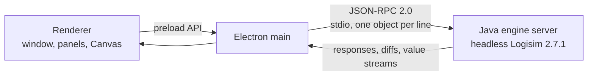

# Hallym Circuit Studio Plan

2026-09-24 · Hakhyeon Kim (김학현) (AIAC Lab, Hallym University) · Revised 2026-09-28: Hallym Circuit Studio 2 (D-132)

> **Scope of this round of development (v2).** Rebuild the screen from scratch in Electron and run the Logisim 2.7.1 engine unchanged inside it (3.1, D-132). Finish all of v2 roadmap N-00 through N-28 (9.2) and publish v2.0.0. All features of v1 (stages 0–4 and chapter 11, the Swing edition v1.0.x) move over to the new screen (`docs/v1-feature-parity.md`).
> The Verilog connection (chapter 7, roadmap stages 5–9) is **not implemented.** Instead, the design principles of 7.0 are kept so it can be attached later.
>
> **How to read this.** Old decisions are not deleted. A changed decision gets a "superseded (D-xxx)" note in place, pointing to the decision that replaced it. Decision numbers are entries in [docs/DECISIONS.md](docs/DECISIONS.md).
>
> ~~**Scope of this round of development (v1).** Implement roadmap stages 0–4 (chapter 9, including 2a, 2b, 2c, 4b) and all of chapter 11's editor improvements. Error diagnostics, MIPS parts, loading a program (.hmx), Cycle View, and editor improvements belong here.~~ Superseded (D-132): ended with v1.0.3 (tag `swing-final`).

## 1. Overview

Hallym Circuit Studio is a Windows-installable Micro-architecture lab tool forked from the classroom's Logisim 2.7.1. It points out to the student where their single-cycle MIPS design is stuck. Later, it will read and write the same design as Verilog.

**Background.** The course spends a semester designing a single-cycle MIPS in Logisim 2.7.1. 2.7.1 stopped development in 2011. Verilog is hard for students to write, so it isn't used in the course.

**Problems to solve.**

- It doesn't say why a circuit doesn't work. It just shows E, or, like a register with no clock, doesn't work with no indication at all.
- Behavior over clock cycles isn't visible at a glance. The student has to press the clock by hand or watch probes one by one, and figure out in their head which instruction it is right now.
- Programs are typed into instruction-memory RAM by hand. The default RAM/ROM only goes up to a 24-bit address, so MIPS's 32-bit addresses can't even be used as-is.
- The editing screen is still 2011. No tabs, awkward zoom and pan, a thin right-click menu, you have to dig through a tree to find a part, and wires don't follow parts. In a big datapath it's hard to see where a signal comes from and where it goes.
- You can design in a circuit, but you can't write the same circuit in Verilog (future scope).

**Design principles.**

- **The tool gives a part library and editing tools, and reports only "a circuit that cannot work."** A circuit that cannot work is one where a value is undefined (E, X, oscillation) or one that structurally cannot work.
- **A "working but wrong circuit" is not judged, fixed, or compared against a correct answer.** This is when 0/1 flows on every wire but the result is just wrong. The student fixes it.
- **The tool does not get involved in student design.** Example: computing the branch destination is the student's datapath's job; the tool only loads QtSpim machine code into memory and emits the word at the corresponding address (D-010).
- Logisim's simulation engine is not modified. New features are a layer built on top of it.
- This principle is the standard for chapter 4 (diagnostics) and chapter 11 (editor improvements). Editing aid (previewing the impact of a port change, listing the instructions a program uses, showing the influence path) is kept because it is not a correctness judgment.

**Goals.**

1. Existing .circ assignment files open as-is, and grading results don't change.
2. A circuit that doesn't work reports one cause, by the name the student gave it, and its location.
3. See the instruction, chosen signals, and register changes for each cycle in one screen, and step back to a previous cycle.
4. Provide Instruction Memory, Data Memory (data + stack), and Console parts that use MIPS's full 32-bit address. Load into that memory the executable image (.hmx) written and assembled in Hallym MIPS Simulator and exported from it.
5. Edit like a modern editor with tabs, zoom, target-specific right-click menus, search, wires that follow parts, and influence paths. Files stay in the original 2.7.1 format (chapter 11).
6. (Future) Read, edit, and write the circuit as Verilog.
7. Finish as a single Windows installer, with no server.

**How the two tools relate.** The same `lw` is seen through two layers. In [Hallym MIPS Simulator](https://github.com/ars2323/hallym-mips-simulator) you watch `lw` change a register; in this tool you watch which wire of the datapath that same `lw` rides on its way to the register file.

| | Hallym MIPS Simulator | Hallym Circuit Studio |
| --- | --- | --- |
| Role in the course | Computer Architecture lab (ISA) | Micro-architecture lab |
| What the student sees | Instructions, registers, memory | Datapath, control signals, cycles |
| Base | SPIM 9.1.24 core (C++), Electron screen | Logisim 2.7.1 engine (Java) + Electron screen (v2, D-132; v1 was Java/Swing) |
| Connection | Writes and runs a .s file and exports it as an executable image (.hmx) | Loads that executable image and runs it in the student's circuit |

## 2. Differences from existing tools

Existing tools show symptoms (E, wire color) and can export a circuit to HDL. But there is no cause diagnosis and no screen tailored to a MIPS course.

| Tool | Form | What it can do | What's missing |
| --- | --- | --- | --- |
| [Logisim-evolution](https://github.com/logisim-evolution/logisim-evolution/releases/tag/v4.1.0) | Java desktop, GPL-3.0, v4.1.0 (Feb 2026) | HDL generation (for FPGAs), chronogram, register State tab, TestVector for sequential circuits | No explanation of the error cause. Exported HDL is for synthesis and is hard to read for learning. No link between instructions and cycles |
| [Digital](https://github.com/hneemann/Digital) | Java desktop | Verilog/VHDL export, test cases, [jump to that state by clicking a test result](https://github.com/hneemann/Digital/releases), iverilog Verilog component | Not compatible with course .circ files. Verilog components are a black box |
| [CircuitVerse](https://blog.circuitverse.org/posts/vivek_kumar_gsoc2025_finalreport/) | Web | Verilog → Yosys → circuit, experimental Verilog export | Needs a server. Imported circuits are black-box subcircuits. No reverse direction |
| DigitalJS | Web | Verilog → Yosys synthesis → schematic, live waveform | It's a synthesis result, so it looks different from the student's code. No reverse direction |

**What only Hallym Circuit Studio has.**

- Diagnostics that point to one cause in a circuit that doesn't work (chapter 4)
- A Cycle View grouped by MIPS instruction, with step-back (chapter 5)
- 32-bit-address MIPS memory parts and direct loading of a Hallym MIPS executable image (.hmx) (chapter 6)
- An editing experience changed while keeping the 2.7.1 file format: file/circuit tabs and cross-tab libraries, target-specific right-click menus, Korean-alias part search, wires that follow parts, influence-path highlighting (chapter 11)
- (Future) Two-way circuit ↔ structural Verilog editing that preserves comments and formatting (chapter 7)
- The same engine students already use with today's 2.7.1, full compatibility with existing .circ assignments

The reason for forking Logisim 2.7.1 instead of switching to evolution or Digital is compatibility. All course assignments and student submissions are 2.7.1 .circ, and grading is based on 2.7.1 results too. evolution redesigned its simulation engine at 4.0, and a file saved by evolution doesn't open in 2.7.1.

## 3. Product decisions

Fork Logisim 2.7.1 without touching the simulation engine, and distribute it the same way as Hallym MIPS Simulator. From v2 on, the screen is rebuilt from scratch in the same Electron as Hallym MIPS, and the engine becomes a Java process running behind the screen (3.1). In the table below, a cell v2 changed puts the new decision first and keeps the old decision marked "superseded."

| Item | Decision | Reason |
| --- | --- | --- |
| Name | Hallym Circuit Studio. Repository `hallym-circuit-studio` | Same product family as Hallym MIPS Simulator |
| Base | Fork of Logisim 2.7.1 | The version students use now. Existing assignments and submissions open as-is, and grading results stay the same. Connection-rule verification (Appendix A) is also based on 2.7.1 |
| Engine | No modifying the simulation core. Run a regression test on every push that compares results against the standard 2.7.1 jar. In v2, the engine is the authority on the circuit model, and edits are sent as intent by the screen for the engine to carry out with original Logisim's edit code (D-133, D-146) | Grading continuity. Same principle as Hallym MIPS not modifying the SPIM core. Even the resulting edited .circ matches the original |
| File format | Keep the 2.7.1 .circ format | A file that uses no new part still opens in original 2.7.1 too, so both tools can be mixed during the transition |
| New parts | MIPS memory, Console, and the multi-radix probe are added as a 2.7.1 JAR library | 2.7.1's official extension method for adding parts without touching the core. Stage 0 confirms whether the same JAR can also be loaded and its parts used in original 2.7.1 |
| Platform | Windows 64-bit. **A single setup exe distributable** (`HallymCircuitStudio-<버전>-win-x64-setup.exe`, electron-builder NSIS, per-user guided install with no admin rights needed, includes the engine and bundled JRE). No app zip or MSI (D-148, D-155). The prior decision "a zip (no admin rights needed) and, from v1.1.0, a setup exe bundling a jpackage app image" (D-122) is superseded (D-132, D-148) | Lab environment, the same install/uninstall file and experience as Hallym MIPS |
| Server | None | Everything runs locally |
| Program input | The executable image (.hmx) exported by Hallym MIPS | The only point of contact between the two tools. .s is not accepted (D-141) |
| Assembling | Done only by Hallym MIPS (SPIM core) | Machine code is bit-identical to QtSpim. This tool has no assembler (6.7, D-141) |
| Editor | The new screen carries over original 2.7.1's tool key and mouse behavior as-is (`docs/interaction-parity.md`, D-139) and adds tabs, zoom, right-click, search, wiring, and influence paths. It does not change values stored in the .circ, like the toolbar layout, mouse mapping, and label font. User settings apply only to this run (D-152). The prior decision "user settings go in app preferences" is superseded (D-152) | The student uses this screen every class hour. Files must be interchangeable with the original, so changes are made only at the display layer (chapter 11). Lab PCs are shared by many |
| Development language | **The screen is Electron + TypeScript** (the same stack as Hallym MIPS: esbuild, its own dom helpers, no UI framework, `node --test`, Playwright, electron-builder). **Inside is a Java 21 engine server** (headless Logisim 2.7.1, JSON-RPC over stdio, 3.1). Track A (lib-mips) stays Java 8 (D-132, D-133). The prior decision "Java, Swing + FlatLaf. No Electron" is superseded (D-132) | User decision. Match the two programs (Hallym MIPS and this tool) with the same materials and same code. The engine stays as-is, so the reason 2.7.1 was chosen (compatibility) remains, and track A stays too. The Swing edition ended at v1.0.3 (tag `swing-final`) |
| Design | From Hallym MIPS `electron/` (reference tag v2.6.0, A-07; first v2.3.0, then v2.5.0, D-155), bring in and use the design values (`app.css` variables) and screen parts (dialogs, start screen, empty states, bands, panel headers/tabs, the Registers/Data/Inspector panels) (`electron/ORIGIN.md`, D-135, D-155). The prior decision "port design tokens to Swing" is superseded (D-132) | The two tools look like one product family, and the same command shows the same field colors and names |
| Fonts | Pretendard for names and sentences, D2Coding for values and addresses (both SIL OFL 1.1, woff2 brought in from Hallym MIPS) | Same as Hallym MIPS. D2Coding distinguishes 0 and O |
| Drawing | Canvas 2D. Part shapes come from vector definitions (outline, curves, port markers, text spots) in a single part renderer registry. Size and port positions are the engine's values as-is, and image export (SVG, PDF, PNG) uses the same definitions too (D-137) | Measuring Canvas vs. SVG elements in ref-mips showed only Canvas held 60fps for wire-color updates during a clock. Same size and ports as the original, so it also connects wires when opened in the original |
| Lab PC | Turn it off and on, and everything is default. The app and engine never write settings to disk. Crash-recovery files go only next to the student's own file (D-152) | Lab PCs are shared by many. Same as Hallym MIPS |
| Course | Logic Design and Lab (논리설계 및 실험), Computer Architecture (컴퓨터구조). **A screen per course** (12.5, A-08, D-168): every launch asks which course first (not remembered), and in the logic design course the MIPS-only parts (Instruction Memory, Data Memory, Console, Stack) and MIPS features (Load Program…, Cycle View's Registers/Memory/Instruction, Mark as PC/Register File, Register Mapping, field colors, the status bar's PC/Program/Changed, the executable-image notice) are hidden. Radix Probe is visible for both courses. The engine and saved file don't depend on the course. The prior decision "the course choice is used only for the tutorial, and the screen layout is the same" (O-08) is superseded (D-168, user 2026-09-29) | One tool is shared by two courses. The logic design course doesn't teach Instruction Memory, Data Memory, or the register file |
| UI language | **Names and commands are English, only explanatory sentences are Korean** (confirmed by the user, D-049). Menus, toolbar, buttons, tabs, status bar, parts, library categories, attribute names and values, right-click menus, part-body titles, search results, shortcut names, dialog titles are all in original 2.7.1's English as-is (Poke Tool, Edit Tool, Wiring, Plexers, Splitter …). New feature names follow the same style too (Load Program, 1 Cycle, Quick Attributes, Fit to Window …). Diagnostic messages, tool description/hover sentences, dialog guidance sentences, the description column of the shortcut table, and tutorial/empty-screen guidance are Korean (English if the language setting is English). Terminology and sentence rules are in `docs/GLOSSARY.md`. v2's detailed rules (status-bar facts are English, no particle right after a name, no "한림" on screen, no "~하면 됩니다" style, `word-break: keep-all`, error wording is what's wrong → what to do) are D-135 item 14 and CLAUDE.md section 10 | It must match the names the student sees in class, in the textbook, and in original 2.7.1. If names were translated, the same thing would have two names |
| License | GPL (version 2 or later) | Follows the fork's origin. Source disclosed on distribution. SPIM (BSD) code is not included (hcs-asm and vendor/spim were deleted in D-141; only SPIM's output remains as test material). Screen code brought in from Hallym MIPS is BSD-3-Clause and can go into a GPL project (noted in NOTICE, D-135) |

**Compatibility note.** A .circ that uses a new part doesn't open in original 2.7.1, which lacks that JAR library. The professor and the user need to agree on when the whole class moves to the new tool.

**School identity elements.**

- **Logo:** symbol mark, logotype, emblem, signature. Used in original form, only size and margins adjusted. Not redrawn or recolored. Follows the school's UI rules, and commercial use is forbidden. Follows Hallym MIPS's precedent.
- **Characters Haram and Hari:** a base form and 20 applied poses exist. Used sparingly only where warmth is needed, like the start screen, tutorial cards, the About window, empty-screen guidance. Never placed next to an error (hidden everywhere on screen while an error dialog or band is showing, D-135 item 14). Per the guidelines, no added elements, no line changes, no proportion/color changes. Not placed over a complex or similarly-colored background, and minimum margins are kept.
- **Start screen video:** behind the start card, a dimmed, blurred first scene of the same school promotional video as Hallym MIPS 2.5.0 (slow, no sound) is laid under a navy overlay. The file and processing match Hallym MIPS byte-for-byte and value-for-value, and under reduced motion it's a still image. The character stands on the card's white background, not on the video. The source is noted in NOTICE (D-155).
- Screens and notices are written as "owned by Hallym University, not for commercial use, not an official university product."

### 3.1 v2 architecture: the screen is Electron, the inside is Java (D-132, D-133)

This is the user's decision (D-132). Everything the user sees is rebuilt from scratch in Electron: window, panels, canvas, part drawings, dialogs, tutorial. Look and flow match Hallym MIPS Simulator. Only what runs inside stays Java: the Logisim 2.7.1 engine, reading/saving .circ, MIPS part logic, diagnostics/recording/path computation. The target feeling is "used almost the same as before, but with more features and a cleaner screen."

**Two processes.**


```mermaid
flowchart LR
  R[Renderer<br/>window, panels, Canvas] -- preload API --> M[Electron main]
  M -- JSON-RPC 2.0<br/>stdio, one object per line --> E[Java engine server<br/>headless Logisim 2.7.1]
  E -- responses, diffs, value streams --> M
  M --> R
```

- **The engine is the authority.** The true state of the circuit model lives in the engine. The screen holds a copy and matches it to the diffs the engine sends.
- **Editing is intent.** The screen turns gestures into intent (place, wire, drag, delete, paste, attributes …) and sends it. The actual change is made by the engine with original Logisim's edit/tool code (merging/splitting wires, connection points, undo history, D-146). That is why the resulting .circ matches the original. This is verified byte-for-byte by the edit-equivalence goldens (`tests/parity`, D-136, D-159).
- **The contract is a documented one:** `docs/engine-api.md` (method groups engine, file, model, edit, sim, diag, find, flow, trace, mips, record). The value stream bundles, once per screen frame, only the visible circuit and the changed nets of subscribed signals (D-134).
- **There is one engine per app**, and it opens several files (tabs) together. The installer bundles a JRE 21 shrunk with jlink. If the engine dies, it's reported via dialog and relaunched, and open files are recovered from the intent journal (D-142).
- **Security:** contextIsolation, no renderer nodeIntegration, the API is opened only through preload. The renderer doesn't talk to the engine directly, the callable methods are fixed, and it cannot pass a path (D-135).
- **Lab PC rule:** neither the app nor the engine writes settings to disk. The engine uses in-memory-only preferences and doesn't read original Logisim's disk settings (D-134, D-152).

**Repository structure (v2).**

```
electron/          # The screen: src/main (window, engine client, recovery file), src/renderer (app, canvas, shared), tests, tools, packaging, docs/screens
engine/            # Java engine server (hcs-engine.jar): kr.ac.hallym.hcs.engine.*
app/               # Fork of the Logisim 2.7.1 source (original + // HCS: lines) and the GUI-less kr.ac.hallym.hcs.app.* used by the engine (the Swing screen was deleted in N-27, D-163)
lib-mips/          # Track A: MIPS parts JAR for original 2.7.1. The engine also bundles the same jar
vendor/logisim-2.7.1/, assets/, tests/, docs/, tools/
```

`native/hcs-asm/` and `vendor/spim-9.1.24/` from the old structure were deleted (D-141).

**What's shared with Hallym MIPS.** From Hallym MIPS's (same author, BSD-3-Clause) `electron/`, bring in screen code Hallym MIPS wrote itself, design values, fonts (Pretendard subset, D2Coding), Lucide icons, and tools (build, screenshots, mutation, packaging). The reference tag is v2.6.0 (A-07; first v2.3.0, then v2.5.0, D-155; the tag of files currently imported is in `electron/ORIGIN.md`). Shared screen parts are gathered into one folder, `electron/src/renderer/shared/`, and the source and what changed for each file are recorded in `electron/ORIGIN.md`. `electron/tools/import-hmips.ts` re-imports and checks byte identity. Files that came from SPIM (instruction tables, native addon, decoders that depend on the core, etc.) are not imported (D-133 item 5, chapter 3 licensing).

**Canvas.** Drawn with Canvas 2D. Part shapes are vector definitions kept in a single part renderer registry (`electron/src/renderer/canvas/registry.ts`), and every part used in the course has its own renderer (`docs/canvas-renderers.md`). Size and port positions are the engine's values as-is, and a geometric-equivalence check verifies, per part kind × representative attribute set, that the renderer draws ports at the engine's port positions (D-137). Value colors (1, 0, floating, error, bus, width mismatch) are defined as tokens with original Logisim's meanings and matched to a legend.

**Screen layout.** A frameless window (no title bar) with the logo, name, file name, toolbar, and only the system window buttons at the far right. The left holds Components/Circuits and Tunnels/Minimap, the center holds file tabs, circuit tabs, and the Canvas, below that Messages/Cycle View/Console, and the right holds Attributes (in Hallym MIPS Inspector form). In a narrow window it collapses and switches to tabs like Hallym MIPS (D-135). The toolbar has the same commands as v1, and the status bar holds only facts.

**Performance targets (measure and report, D-160).** App first start (including the engine) under 4 seconds, opening ref-mips under 2 seconds, panning/zooming ref-mips at 60fps (FHD 100/150%), N Cycles at 1000 no slower than v1, no screen stutter during Run. Measured values and CI limits are in `docs/PERFORMANCE.md`.

## 4. Error diagnostics

The tool reports only a circuit where a value is undefined (E, X, oscillation) or one that structurally cannot work. If 0/1 flows on every wire and only the result is wrong, it stays silent.

### 4.1 Static and dynamic checks

Values alone aren't enough. A register with no clock connected emits neither E nor X — it just holds 0. So checks run in two layers.

- **Static check:** looks only at connection structure and finds problems before simulation. It runs automatically when editing pauses and a list appears in the diagnostics panel.
- **Dynamic check:** looks at values during simulation. It reports at the cycle where E/X first appears.

### 4.2 Check list

| Situation | What Logisim shows now | What the tool will report | Check |
| --- | --- | --- | --- |
| Register/RAM clock not connected | Nothing. The value just doesn't change | Which register's clock is empty | Static |
| Two outputs drive one wire (short) | Red wire, E | The names and locations of the two conflicting parts | Static |
| Bit width mismatch | Orange wire | Both parts and their widths (e.g. 32-bit ↔ 5-bit) | Static |
| Unconnected input | Blue wire. If `gateUndefined=ignore`, the gate silently ignores it | Which part, which numbered input | Static |
| Unpaired tunnel | Blue wire | The tunnel name and similar-name candidates (e.g. RegDst ↔ RegDest) | Static |
| Subcircuit port not connected | Blue wire or nothing | The subcircuit name and port name | Static |
| Combinational loop | Oscillation warning, then stops | Highlight the path forming the loop | Static + dynamic |
| E/X spreads to many places | E everywhere | The one spot where it first appeared | Dynamic |
| X written to a register/memory | X shows up somewhere unexpected a few cycles later | The cycle it was written and its cause | Dynamic |

Using the MIPS parts (6.2) also catches access to an address in no memory region (including between the data and stack regions), a non-word-aligned address, exceeding the stack limit, memory part region overlap (e.g. a new Data Memory next to an old Stack), and a floating MemWrite·MemRead·Syscall. This list is a draft. It's finalized from "doesn't work" cases that came up often in past-semester TA questions and submissions.

**What is not reported (chapter 1 design principle).** Correctness judgment of a circuit that works, comparison against a correct answer (SPIM's execution result), and warnings about risky-looking designs (like a clock made from gates). A wire connected by passing over someone else's port is also not a diagnostic. It's only drawn large enough to be visible on screen (11.9), and any short it causes is caught by the existing short-circuit diagnostic.

### 4.3 Tracing the source of E/X

From a wire where E/X is visible, trace back toward the inputs and stop at the one place it first appeared.

1. Follow, among the inputs of the part driving the current wire, whichever are E/X.
2. Stop at a part whose inputs are all defined but whose output is E/X, a wire with no driver, or a wire with two drivers. That's the cause.
3. Cross into a subcircuit boundary when one is met.
4. At a register, go back in time and continue from the inputs of the cycle where X was written. This step uses the recording engine of chapter 5.

### 4.4 Message principles

- **State only one cause.** Even if E is visible in twenty places, state only the one place it first appeared.
- **Speak using the name the student gave.** Not "Register @ (340,120)" but "datapath › PC". If there's no label, use the subcircuit path and part kind instead.
- **State facts and location only.** Don't say how to fix it.
- **Clicking goes there.** Clicking a message enters the relevant subcircuit and highlights the part and wire. Dynamic diagnostics also move the Cycle View to that cycle.
- **Never block.** Report through the diagnostics panel and an on-schematic marker instead of a popup. The student can keep editing.

Example messages:

- The clock input of register `datapath › PC` is not connected, so its value never changes.
- A wire in `datapath` is driven together by `ALU`'s output and `SignExt`'s output.
- X was written to `RegFile` at cycle 4. Cause: `control › RegWrite`'s output is undefined.

## 5. Cycle View

Place a Cycle View below the schematic. Each column is one clock cycle, showing the instruction, chosen signals, and register changes in one screen.

### 5.1 Screen layout

- **Control bar:** previous cycle, next cycle, run until, current cycle number.
- **Cycle table:** columns are cycles, the header shows PC and the instruction. The instruction is disassembled the same way as SPIM's text, and labels come from the executable image's symbols (a .hmx has no original line per word, hmx-feedback.md). Rows are the chosen signals. A 1-bit signal shows as a waveform, a bus as a value.
- **Registers panel:** PC, the register file, memory writes. The current `$sp` and stack depth (the value subtracted from SPIM's starting `$sp` `0x7FFFEFFC`) also show here. It reads `$29` from the register file (5.3). The Stack part doesn't know `$sp` and shows only the area used (the high-water mark) (6.2, D-050). Values changed in the current cycle are highlighted. Values show hex, decimal, and binary together on one line. Click once per register to switch its primary display radix. Decimal picks signed or unsigned, and binary is grouped in 4-bit chunks. Same look as Hallym MIPS's register window (grouped by role, `$name` plus number, hex and decimal, a changed value in teal text `#00736F` on a pale teal background `#E6F6F5`. No bold, since it would break alignment in the fixed-width columns). Track A also puts a multi-radix probe part in the library that gives the same display.

### 5.2 Behavior

- **Click a column:** the whole schematic (wire color, bus values) switches to that cycle's values. Going into a subcircuit keeps the same point in time.
- **Step back:** replays the recording. Changing an input or editing the circuit at a past cycle discards the recording after that point and continues forward from there.
- **Run until:** the condition can be a PC value, a change to a specific register, a specific instruction kind (e.g. the next `beq`), or an E/X occurring. There's a max-cycle limit in case of an infinite loop.
- **Add a signal:** clicking a wire on the schematic adds a row. A bus is one row of hex value, expanded into bits only when needed. Hovering any wire on the schematic shows hex, decimal, and binary together.
- **Click an instruction:** like Hallym MIPS's Instruction Inspector, it spreads the 32 bits out with per-field color. The same colors are painted on the datapath's wires too — for example, the `rs` field's color is painted on the wire going to Read register 1.

### 5.3 Finding PC, the instruction, and the register file

- **PC and instruction:** in Instruction Memory (6.2), or whichever instruction memory was chosen when loading a program, the address input is PC and the data output is the instruction. No separate specification needed.
- **Register file:** hard to find automatically since it's a subcircuit the student made. Right-click a subcircuit to "Mark as Register File", or a TA specifies it in the assignment template.
- **If nothing is specified:** list every register and RAM in the circuit by subcircuit path.

### 5.4 Recording engine

- Every step, record every net's value as a diff only. This is because it's not known in advance which signal will be needed.
- Cycle View and dynamic diagnostics (4.3) use the same recording.
- The maximum number of cycles kept is decided after measuring memory use with assignment circuits.
- 2.7.1 has no chronogram, so this is built from scratch. The structure for recording signal values takes reference from 2.7.1's Logging feature (Simulate › Logging).

## 6. MIPS parts and loading a program (.hmx)

Provide Instruction Memory, Data Memory (data + stack), and Console parts that use MIPS's full 32-bit address. Pick an executable image (`.hmx`) assembled and exported by Hallym MIPS and load it into this memory. The spec's source is Hallym MIPS's [`docs/hmx-format.md`](https://raw.githubusercontent.com/ars2323/hallym-mips-simulator/v2.4.0/docs/hmx-format.md), pinned at tag v2.4.0. Where we differ from the spec, follow the spec, and record only our own choices for what the spec leaves open in docs/hmx.md (D-138). The spec's 7 golden pairs are fetched into `tests/hmx/hallym-mips-v2.4.0/` and checked against. Unlike the screen/shared-code reference tag (v2.6.0), the spec and goldens stay at v2.4.0 (D-155). v2.6.0's spec is byte-identical to v2.4.0, and the goldens differ only in the header's produced-by and assembled fields (A-07). The point of contact between the two tools is a single executable image file. The student assembles with Ctrl+S in Hallym MIPS, then loads the file exported with the Export executable image (.hmx) button in the icon cluster to the right of the title bar. .s is not accepted (user decision, D-141): Hallym MIPS 2.4.0 shipped the export feature, which removed the transition-period .s loading and hcs-asm.

### 6.1 Limits of the default RAM and ROM

- Logisim 2.7's [RAM](https://www.cburch.com/logisim/docs/2.7/en/html/libs/mem/ram.html) and [ROM](https://www.cburch.com/logisim/docs/2.7/en/html/libs/mem/rom.html) go only up to a 24-bit address (16,777,216 entries), 32-bit data. MIPS's 32-bit address can't be used as-is, so the student connects only part of the address bits.
- A truncated address silently aliases. A wrong-address `lw`/`sw` just accesses a different cell with no indication at all.
- RAM contents are not saved to the .circ. Only ROM has its contents saved as an attribute in the file. If a program is placed in RAM, it has to be re-entered every time the file is reopened.
- RAM's `sel`, `ld`, `str` inputs are treated as 1 when floating. It works with no error even if the connection is missing.
- The default parts are not modified. Because of existing-assignment compatibility and the core-invariance principle (chapter 3). Instead, the new parts below support 32-bit addresses.

### 6.2 MIPS memory parts

| Part | Ports | Default address region | Initial contents |
| --- | --- | --- | --- |
| Instruction Memory | Input `Addr` (32), output `Instr` (32). No clock, read-only | From `0x00400000` (.text) | The executable image's .text |
| Data Memory (data + stack) | Input `Addr` (32), `WriteData` (32), `MemWrite`, `MemRead`, clk. Output `ReadData` (32) | Data `0x10000000`–`0x100FFFFF` (growing toward higher addresses; `.data` starts at `0x10010000`), stack `0x7FFC0000`–`0x7FFFFFFF` (growing toward lower addresses) | The executable image's .data. The stack starts empty (0) |

The default addresses match QtSpim (SPIM 9.1.24): data is a 1MB range from `DATA_BOT` to `DATA_LIMIT`, and the stack is 256KB right below `STACK_TOP` (`0x80000000`) down to `STACK_LIMIT` (source lines in docs/mips-components.md). The addresses seen in Hallym MIPS appear exactly the same in the circuit. **As in real MIPS, there is a single data memory** (user decision, D-140): in the student's single-cycle datapath, `lw`/`sw` and `$sp` access go to the same one Data Memory. The formerly separate Stack part is kept for old files but dropped from the list of parts to place newly (dropped from the v2 list; it stays in original 2.7.1's list as "Stack (old circuits)" so old files can still be opened). An old .circ's Stack, and a Data Memory with no stack region, still open and behave exactly as before, per their saved attributes. Since the QtSpim-based simulator doesn't use .bss or the heap, those regions are not provided separately. An access to an address between the data and stack regions is diagnosed as an address in no memory region.

**Common behavior.**

- **Takes the full 32-bit byte address as-is.** PC and the ALU result connect straight in, with no splitter. Word access ignores the low 2 bits.
- **Sparse storage.** Only written pages use memory. There's no size cost even with the full 32-bit address space.
- **Does not drive output for an out-of-range address.** If it's outside both regions, `ReadData` is not driven (floating) and no write happens either. This lets `ReadData` from several memory parts (e.g. an old Data Memory and Stack) be tied to the same wire; only the one whose region the address belongs to drives a value. An address in neither region is reported by diagnostics.
- **The same timing as the textbook's single-cycle.** Read is combinational (no clock); write happens on clk's rising edge when `MemWrite` is 1.
- **A floating control input is not treated as 1.** It doesn't write, and diagnostics report it. This differs from the default RAM.
- **Word access only.** Byte/halfword access (`lb`, `sb`, `lh`) is not supported. A non-word-aligned address is reported by diagnostics.
- **Attributes.** The two regions' start address (for the stack, the top word) and size can be changed (`base`, `size`, `stacktop`, `stacksize`). A newly placed instance gets both regions, and an old file's Data Memory with no attribute recorded is read with the v1 values (data starting at `0x10010000`, 1MB, no stack region) (D-140 attribute design).
- **Growth direction and limits.** Data grows from the start address toward higher addresses, and the stack grows from the top word toward lower addresses. The limit is changed via attribute. Since it's sparse storage, a large limit costs nothing beyond the pages actually written.
- **Reports only what doesn't work.** An address in neither memory region (including between the two regions), a non-word-aligned address, an access near (within the limit's width of) the stack region's limit gets "Stack usage exceeded the limit (256KB)", overlap between two parts' regions, and a floating control input. States facts only, without guessing at cause or fix. A file with an old Stack part is reported not as a diagnostic but as one status-bar fact: "This circuit uses a separate Stack part. The new Data Memory also handles the stack region."
- **Appearance.** Inside the part, the two regions' ranges, the word at the current address, and usage (`data N words, stack peak N B`: number of data words, the highest-water-mark down to the lowest stack address accessed) are shown. The part doesn't know `$sp`, so current depth is not shown. The last accessed address is not `$sp` (D-050). Full contents are viewed in the Memory panel: like Hallym MIPS's Data tab, one table shows the data region (from `0x10010000`, .data labels) together with the stack region (higher address on top, `$sp` marked), with runs of zero collapsed into one line. Current `$sp` and depth are shown in the Registers panel (5.1) reading `$29` from the subcircuit marked "Mark as Register File".
- **Saving.** Instruction Memory saves the executable image (.hmx) path and a machine-code snapshot into the .circ, so the file works even without the .hmx. An old file's leftover .s path is read only (the file still opens and saves as before); v2 shows this when the file is opened (N-16), and Track A shows it in the right-click menu and load dialog as a fact and next step: "This file points to a .s file. Load the file exported with the Export executable image (.hmx) button in Hallym MIPS." Picking a .hmx changes the path (D-141). Data Memory does not save values written during execution — resetting returns to the .data initial values (the stack region resets to 0).
- **Verilog (future).** Maps to the standard-library modules `lg_imem`, `lg_dmem`, with initial contents exported via `$readmemh` (7.7).

### 6.3 Load flow


```mermaid
flowchart LR
  A[Choose .hmx] --> B[Read<br/>executable-image parser]
  B --> C[Decide which memory to fill<br/>.text / .data]
  C --> D[Check address]
  D --> E[Load]
  E --> F[Save the setting to .circ]
```

If MIPS memory parts are used, picking the executable image file is all it takes. .text goes to the Instruction Memory holding that address, .data goes to the Data Memory holding that address, and there's nothing to check since the address is exactly the file's own. If there's no matching part, or the file has an error, it says why and loads nothing. It only asks which part when there's more than one of the same kind. Only existing assignments using default RAM/ROM go through 6.4's memory selection and 6.5's address rules.

### 6.4 Memory selection (when using default RAM/ROM)

- Show every RAM and ROM in the circuit with its subcircuit path and size. Example: `datapath › InstrMem (RAM, 8비트 주소 × 32비트)`.
- Pick from the list, or click the part on the schematic. `.text` and `.data` can each be assigned to a different memory.
- If a TA has pre-specified it in the assignment template, the student only picks the file.

### 6.5 Address rules

- **MIPS memory parts:** loaded at the executable image's addresses as-is. No relocation. Starting PC at the entry point (`0x00400024`) is something the student sets up in the circuit.
- **Default RAM/ROM:** words are placed in order starting from cell 0. Since the machine code is addressed for SPIM, if the student's circuit uses only the low address bits, the `j` destination and `.data` label addresses may not line up. This is the compatibility path for existing assignments; new assignments use the MIPS memory parts.
- **Includes startup code (Hallym MIPS's layout, D-126):** Hallym MIPS has loaded the default exception handler by default since 2.2.0. The 9-word startup code `__start` sits at `0x00400000`–`0x00400020`, and the student's `main` at `0x00400024`. This tool loads the executable image's `.text`, including the startup code, at the file's addresses as-is (no truncation or relocation). The start address comes from the file's `entry` line; the tool does not guess it from startup code length or a symbol. The kernel segments (`.ktext`, `.kdata`) are not loaded. The old approach ("assemble with the exception handler off so main lands at `0x00400000`") has been replaced by this. An image assembled without the exception handler (entry = the program's `__start`) is also accepted, and the summary shows this fact (D-138).
- **`$sp` initial value:** the student's job. SPIM presets `$sp`, but the student's register file starts at 0, so the program or the circuit must initialize it. Skipping it is reported as an access to an address in no memory region. The executable image's `reg $sp` (e.g. `0x7fffffe4`) is used only as the reference for measuring Data Memory's stack-region depth (D-126, D-140).

### 6.6 Scope of what is loaded

- The executable image Hallym MIPS exports is loaded as-is. Pseudo-instructions (`li`, `la`, `move`, etc.) are already expanded by Hallym MIPS (SPIM) into the real instruction words. `syscall` is loaded as machine code as-is too.
- .text goes to Instruction Memory, .data goes to Data Memory's data region. The stack region is left empty (its contents are not in the executable image). .bss, the heap, and kernel segments are not loaded.
- Everything after that is the student's design. Once the clock runs, both memories behave like real RAM (6.2). The tool doesn't check whether the student's datapath actually executes those instructions.
- Instead, after loading, it shows the list of instructions the program actually uses (e.g. `lui`, `ori`, `lw`, `add`, `beq`). This lets the student know what the datapath needs to support.

### 6.7 Assembler

- **Assembling is done only in Hallym MIPS (D-126, D-141, user decision).** The student assembles with Ctrl+S in Hallym MIPS, then exports with the Export executable image (.hmx) button in the icon cluster to the right of the title bar. This tool only reads that executable image (`.hmx` version 1, docs/hmx.md) with a parser shared between the two tracks, and has no assembler of its own. Load Program's file picker shows only .hmx files.
- The key point is assembling exactly like QtSpim. Hallym MIPS assembles with an unmodified SPIM core (`CPU/`), so even pseudo-instruction expansion matches QtSpim exactly. The same .s gives bit-identical addresses and machine code to Hallym MIPS. The tool shows the machine code in the same form as Hallym MIPS's Instruction Inspector, breaking 32 binary columns into per-field colors.
- The standard assignment setting is Hallym MIPS's default (exception handler loaded, delayed branch off, pseudo-instructions on) (D-126).
- **The machine code is QtSpim as-is (D-010, confirmed by the user).** The executable image's words are loaded without change. There is no setting to choose an encoding. Computing the branch destination is the student's datapath's job. For reference, SPIM with delayed branch off encodes the branch offset relative to PC, while the textbook explains it relative to PC+4.
- **The old approach (for the record).** v1 used a command-line tool, hcs-asm (BSD, a separate executable), linking the SPIM core, to assemble .s directly. After the switch to the executable image (D-126), it survived only as a transition-period .s path, and once the Hallym MIPS 2.4.0 golden comparison (D-138) passed, it was deleted along with hcs-asm, `native/`, `vendor/spim-9.1.24`, and the SPIM build in CI (D-141). SPIM's output (disassembler goldens, execution oracle) was hardened as test material before deletion (docs/hcs-asm.md).

### 6.8 Automatic reload

- The .circ saves the executable image (.hmx) path (relative) and memory assignments.
- Reloads on simulation reset, reopening the file, and .hmx file changes (v2 N-16). If a .s was edited in Hallym MIPS, it must be re-exported: comparing against the original tells you "changed since export" (docs/hmx.md).
- An old file's .s path is not re-assembled (D-141). It reports only the fact and next step (6.2 saving).

### 6.9 Console part

Program output is shown via a Console part that the student places and wires into the circuit, like a register. Since the SPIM core only assembles and the student circuit does the running, handling `syscall` is also the circuit's job.

| Port | Width | Meaning |
| --- | --- | --- |
| `Syscall` | 1 | 1 if this cycle is a `syscall`. The student's control unit decodes it |
| `V0` | 32 | The value of `$v0` (the syscall number) |
| `A0` | 32 | The value of `$a0` (the value or string address to output) |
| clk | 1 | Handled on a rising edge when `Syscall` is 1 |

**Supported syscalls.**

| `$v0` | Behavior |
| --- | --- |
| 1 | `print_int`: output `A0` as a signed decimal |
| 4 | `print_string`: read a string from Data Memory (data/stack regions, including old Stack) directly, from the `A0` address up to a zero byte, and output it |
| 11 | `print_char`: output the low 8 bits of `A0` as a character |
| 10 | `exit`: end the program. Stops the simulation clock |

- Any other number, or a floating `Syscall`, is not handled and is reported by diagnostics. Input syscalls (`read_int`, etc.) are added later.
- `print_string` reads the MIPS memory part's contents byte by byte. The student's circuit only needs word access. Byte order is little-endian, same as SPIM.
- Recent output lines show inside the part (like 2.7.1's TTY part). So output is visible even in original 2.7.1 with just the JAR library.
- The app has Messages · Cycle View · Console tabs at the bottom (v2, D-135). Console is program output, Messages is diagnostics (chapter 4). v1 (Swing) had two tabs, Console / Messages, like Hallym MIPS.
- The student runs the same .s in both Hallym MIPS and their own CPU and compares the outputs themselves.
## 7. The Verilog connection (future scope)

> This chapter is **not implemented** in this round of development. Only 7.0's principles are reflected in the current code now; 7.1–7.7 are kept as design notes for the next stage.

Build on the MIPS circuit the student has already made to let them read, edit, and write Verilog. No testbench is needed. Parts written in Verilog are also checked inside the Logisim circuit, by clicking and by .s programs.

### 7.0 What to keep in the current implementation

- **The circuit model is the center.** Diagnostics, the recording engine, Cycle View, and MIPS parts take the Logisim circuit model (`Circuit`, `Component`, `Wire`, nets) as input, not the GUI. In v2, these live inside the engine and the screen calls them through the engine API (3.1). Later, the Verilog view will also look at the same model through the engine API.
- **A name is an ID.** Keep a shared utility that treats part labels, subcircuit names, tunnel names, and port names as identifiers. The "datapath › PC" path notation in diagnostic messages and future Verilog instance/net names follow the same rule.
- **Part kinds are handled in one place.** Gather per-part-kind handling (diagnostic rules, display method) into a registry instead of scattered `instanceof` branches. The future Logisim ↔ Verilog mapping table (7.5) attaches to the same registry.
- **Match new parts' port names to Verilog module ports.** The port names of Instruction Memory, Data Memory, Stack, and Console are chosen so they can be used as-is as `lg_imem`, `lg_dmem`, `lg_console` module ports.
- **One scheme for .circ extension attributes.** Gather the additional information the tool saves to the .circ (register-file marking, watch list, tunnel color, signal group, area memo, splitter arm name) into a single namespace, so original 2.7.1 can open it while ignoring it. Future coordinates and Verilog metadata will use the same scheme. The format is: at the end of `<project>`, a single `<hcs:ext>` element (D-024). MIPS parts' own information (executable image path, memory contents) is saved as the new part's own attributes (an old file's .s path is read-only, D-141).

### 7.1 Learning flow

| Stage | What the student does | Feature needed |
| --- | --- | --- |
| Reading | Watch the Verilog of the circuit they drew, off to the side. Editing the circuit changes the code | Circuit → human-readable structural Verilog |
| Starting to write | Write Control, ALU Control, and the register file as Verilog code blocks | Behavioral code blocks |
| Fixing | Changing a name or connection in the code changes the circuit | Live two-way editing, incremental wiring |
| Writing | Write code in an empty module to create the circuit | Verilog → circuit, automatic placement and wiring |

### 7.2 Role of each MIPS part

| Part | Verilog form | Role |
| --- | --- | --- |
| ALU, adder, MUX, sign extend | structural, `assign` | Reading: "oh, this is what my circuit looks like as code" |
| Control, ALU Control | `case` statement | Motivation to start writing: an easier first moment than drawing a truth table with gates |
| Register file | `reg` array | A huge circuit becomes a few lines of code |
| Top-level datapath | module instances | The main stage for two-way editing |

### 7.3 Shared model

Neither the Verilog nor the schematic is the source of truth. Both are views onto one shared model, the Logisim circuit model.


```mermaid
flowchart LR
  V[Verilog source<br/>comments and formatting preserved] <--> M[Shared model<br/>Logisim circuit model]
  M <--> S[Schematic<br/>coordinates preserved]
  M --> Sim[Logisim simulation]
  Sim --> C[Cycle View, diagnostics]
```

Editing always goes through the shared model. A change on one side becomes a model diff, and only that diff is applied to the other side.

- Use Logisim 2.7.1's `Circuit`, `Component`, `Wire` as-is. One subcircuit is one Verilog `module`.
- The only new part is a Verilog code-block part. It's added via 2.7.1's JAR library method (chapter 3).

### 7.4 Code blocks

- `always` and `assign` blocks are not broken down into gates; they go into the schematic as a single box. Ports are auto-extracted from the signals the code reads and writes.
- Double-clicking opens the code editor. The synthesis-result preview is read-only.
- Simulation synthesizes to gates in the background with Yosys, then runs inside the Logisim engine. Only the code box shows on screen.
- Only a synthesizable subset is allowed: `assign`, `always @(*)`, `always @(posedge clk)`, `if`, `case`, arithmetic/logical operators. `#delay`, `initial`, `$display` are flagged as errors and that block is not executed.

### 7.5 Two-way structural editing

- **Coordinate preservation:** when exporting to .v, coordinates are put into a Verilog-2001 attribute. iverilog and Yosys ignore this. A new instance with no coordinate is auto-placed near its connected neighbors (Appendix A).

```verilog
(* lg_pos = "120,80" *)
full_adder fa0 (.a(a[0]), .b(b[0]), .cin(c0), .s(s[0]), .cout(c1));
```

- **Patch instead of regenerate:** Verilog parsing uses ANTLR (the grammars-v4 Verilog grammar). A schematic change fixes only the relevant tokens via `TokenStreamRewriter`. Comments, whitespace, and code order stay untouched.
- **Correspondence:** instance names and net names are the ID. A wire drawn with no name gets an automatic name like `w_1`, `w_2`.
- **Exceptions:** while there's a syntax error, the schematic freezes at the last valid state and only the error location is marked. `generate` and `parameter` show their expanded result read-only. In simultaneous editing, whichever side has focus holds edit rights.

| Logisim | Verilog |
| --- | --- |
| AND/OR/NOT etc. gates | gate primitives `and`, `or`, `not` |
| Subcircuit | module instance |
| Splitter | bit slice `a[3:0]`, concatenation `{a, b}` |
| Tunnel | a net of the same name |
| Constant | a literal like `4'b0000` |
| Pin (input/output) | `input` / `output` port |
| Built-in parts like MUX, register, RAM | standard-library module (e.g. `lg_mux #(.WIDTH(32))`) |

This table is finalized by pulling the list of parts actually used in MIPS assignments.

### 7.6 Beginner mistakes become visible in the circuit

| Mistake | In the code | In the circuit |
| --- | --- | --- |
| A net-name typo (`carry` → `cary`) | An implicit 1-bit wire is silently created | A wire connected to nothing. Chapter 4's diagnostics report it as an unconnected input |
| Positional port order wrong | Syntactically fine | Inputs and outputs swapped |
| Bit width mismatch | One warning line, or ignored | Width-mismatch diagnostic |
| Missing module instance | Compiles fine | A floating output pin |

### 7.7 Testbench and the next course

By default, verification happens inside the circuit with no testbench. As an optional feature, exporting the whole MIPS to .v also auto-generates the loaded .s as a `$readmemh` file and a simple testbench. It can be run right away with iverilog, becoming a bridge to the next course.

## 8. Deployment and development environment

**The Windows distributable is a single setup exe** (user decision, D-148). The same electron-builder NSIS installer as Hallym MIPS, including the engine and bundled JRE, so nothing extra needs to be installed on the student's PC. No app zip or MSI is distributed.

> Old decision (superseded, D-132/D-148): "Distribute as a zip with a bundled JRE, and from v1.1.0 also as a setup exe bundling a jpackage app image. No MSI (D-122)." The Swing edition v1.1.0 was never shipped. The v1.0.x releases (zip, and MSI up to v1.0.2) stay published as-is.

### 8.1 Deployment

- **Installer:** `HallymCircuitStudio-<버전>-win-x64-setup.exe`, x64 only. Installed per-user with no admin rights, at `%LOCALAPPDATA%\Programs\Hallym Circuit Studio`. Guided like Hallym MIPS 2.5.0: progress screen → finish screen (an "Run now" checkbox), Korean install screens, a navy band on the left with the school symbol, the app's blue progress bar. It doesn't ask for the install folder or user scope. There's a Start Menu shortcut, an uninstall entry, and reinstall-over support; no auto-update, no desktop shortcut, no `.circ` file association (D-148, D-155). Silent install is `/S`.
- **Old install:** the v1.0.x MSI installer is silently removed after placing the new program (found by UpgradeCode). The v1.0.3 zip isn't an install, so it's left alone (D-148).
- **Code signing:** none — no certificate. Add SmartScreen guidance to the release notes and the manual (More info → Run anyway).
- **What's uploaded alongside:** only track A files (`hcs-mips.jar`, the track A zip) and a guide PDF whose name contains `guide`. CI fails if any other file is attached to a release (`electron/tools/release-assets.ts`).
- **Bundling:** the assembler is not bundled (assembling is done in Hallym MIPS, D-141). The system PATH is untouched. (Future) Yosys for code blocks goes into the install folder and is called by relative path.
- **Licensing:** fonts are the same Pretendard/D2Coding as Hallym MIPS (SIL OFL 1.1). License files go into the install folder and show in About › Licenses. SPIM code is not in the distributable (D-141).
- **Track A distribution:** the MIPS parts JAR library and usage guide are distributed as a separate zip. Loaded in original 2.7.1 via Project › Load Library › JAR Library.
- **Pre-release and full release:** before v2.0.0, every major batch is uploaded as `v2.0.0-alpha.N` as a GitHub pre-release (not Latest). v2.0.0 goes up as a public release (Latest) once every item in 9.2 is done. Old releases are not deleted. The tag goes on the commit that bumped the version, and size and hash are recorded only for the published asset (D-154). The order is in `docs/release.md`.
- **Post-release verification:** fetch the setup exe from the public URL and check the hash → install quietly on a clean Windows → start screen → both track tutorials → load and run a sample .hmx → ref-mips N Cycles → zero registry/AppData change after exit → uninstall.
- **Updates:** in-semester bug fixes are handled by shipping a new version. Auto-update is out of scope.

### 8.2 Development environment

- Development and testing are done on Linux (Node 22.18+, JDK 21 via Gradle toolchain).
- The Windows installer and bundled JRE are built on GitHub Actions' Windows runner (the bundled JRE differs by OS). The old decision "package Windows with jpackage" is superseded (D-148).
- Install, run, uninstall, and zero change before/after a run are automatically checked on CI's clean Windows runner (D-148); lab-PC confirmation is left as needs-human.

### 8.3 Testing

| Test | Content | Pass criterion |
| --- | --- | --- |
| Engine regression | Run an existing set of assignment .circ files with the same input in both the standard 2.7.1 jar and the fork | All net values match |
| Diagnostics | A "collection of broken circuits" seeded with known errors, plus normal assignment circuits | Broken circuits get the expected message, normal circuits get 0 messages |
| Edit equivalence | v1 replays the same intent-unit scenarios that built the reference result .circ (`tests/parity`) with original edit code, and v2 sends the same intents to the engine | Byte match with the golden (D-136, D-159) |
| Geometric equivalence | For every part kind × representative attribute combination, the port position the engine gives vs. what the renderer draws | Every combination matches (D-137) |
| Interaction equivalence | The original 2.7.1 tool/key/mouse-behavior table (`docs/interaction-parity.md`) | e2e passes for every row of the table (D-139) |
| Open and save | Open and save a .circ using no new part | Byte-identical to original 2.7.1 (D-006, D-149) |
| Screen e2e | Playwright, 1920×1080 at 100/125/150%. Main flows also with the real engine | Passes. The tutorial passes the five checks of chapter 12 at every step |
| Windows installer | Install/run/uninstall on a clean Windows runner, install over v1.0.2 MSI | Only what was installed changes, and zero change before/after a run (D-148) |
| Load match | Load golden executable images exported by Hallym MIPS (tag v2.4.0) and a hardened SPIM list, and compare against what's read back from the part | Address, machine code, and data match (D-138, D-141) |
| MIPS parts | Run a sample executable image on a reference single-cycle MIPS circuit | Register, memory, and Console output match SPIM's execution result (a hardened oracle) |
| (future) Verilog round trip | assignment .circ → .v → .circ | 0 connection mismatches. Track bends, crossings, total length |
| (future) Connection rules | `rules_test*.circ` (Appendix A) | Matches the predicted connection result |

On every push, run the engine regression, diagnostics, equivalence, load match, MIPS parts, screen e2e, and Windows installer tests. The broken-circuit collection is built from real cases from past semesters.

## 9. Development roadmap

### 9.1 v1 roadmap (stages 0–4b, complete)

Ended with v1.0.0–v1.0.3 (the Swing edition). Stage 2a's "apply FlatLaf, design tokens, Pretendard, window structure and tabs, auto-save" and the Swing screen of 2b–4b are rebuilt from scratch by v2's new screen (superseded, D-132). The engine-side results (diagnostics, recording engine, connection search, MIPS parts, executable-image loader) are used as-is by the v2 engine.

Proceeds along two tracks. Track A (stage 1) is a JAR library built against the 2.7.1 jar, so it can start and ship right away without a fork. Track B (from stage 2) forks the 2.7.1 source to change the UI. Each finished stage is usable in class.

| Stage | Content | What becomes possible when done | This round's scope |
| --- | --- | --- | --- |
| 0. Foundation | Obtain the 2.7.1 jar/source, confirm the JAR library method, build the SPIM command-line tool, sort out the list of assignment parts, finalize Hallym MIPS's standard assignment settings (exception handler, delayed branch) | Both tracks are ready | Yes |
| 1. MIPS parts library (Track A) | Instruction Memory, Data Memory, Stack, Console, multi-radix probe parts. Load a .s from the part menu (Load Program after D-126, .hmx only from D-141) | Programs can be loaded and run even in original 2.7.1, and output seen. Hand-entered RAM disappears | Yes |
| 2a. Fork + editor foundation (Track B) | Fork the 2.7.1 source, build with a modern JDK, engine regression tests, apply FlatLaf/design tokens/Pretendard, window structure and tabs (11.1, excluding cross-tab libraries), zoom (11.2), auto-save (11.13) | The fork is usable day to day | Yes |
| 2b. Editing core | Right-click menu, attribute editing, quick Probe, search and commands, toolbar/status bar/operations, label chips, density, tunnel auto-color, hover info, tunnel jump, Ctrl+F, splitter editor (11.3–11.7, part of 11.11–11.12) | Editing gets faster | Yes |
| 2c. Static diagnostics + wiring | Finalize check list, static diagnostics and a Messages tab, wires that follow parts (11.9), influence path (11.12), subcircuit instance guidance and port-change impact (11.10), cross-tab libraries and save propagation (11.1) | You know why a circuit doesn't work | Yes |
| 3. Recording engine + Cycle View | Record every net, cycle table, source-line display, registers panel, step back, run until, Console tab, auto-reload, bus value display and active path (11.12) | Watch and undo clock behavior in one screen | Yes |
| 4. Dynamic diagnostics | E/X source tracing, oscillation path, X-recording detection, tied into Cycle View | The tool answers "why is this E?" with one location | Yes |
| 4b. Convenience wrap-up | Duplicate N and align, port ordering, import from another file, bus width and legend, signal group color and cross jump, undo list, submission file, image export, minimap, area memo, side-by-side view and window split, keybinding customization (rest of chapter 11) | Assignment submission finishes inside the tool | Yes |
| 5. Circuit → Verilog view | Human-readable structural output, coordinate attribute, live update | Reading | Future |
| 6. Code blocks | Bundle Yosys, port extraction, synthesizable-subset check | Write Control, ALU Control, register file as Verilog | Future |
| 7. Live two-way | ANTLR parsing, token patching, ID correspondence, incremental wiring, freeze on error | Fixing | Future |
| 8. Verilog → circuit | Automatic full-module placement and wiring with no coordinates (Appendix A) | Writing | Future |
| 9. (Optional) .v export | Full MIPS .v, `$readmemh` file, auto-generated testbench | Bridge to the next course via iverilog | Future |

**Priority reasoning.**

- Stage 1 needs only a jar, and the student feels it right away (no hand-entered RAM, 32-bit addressing, checking output). The SPIM-core connection pipeline is also verified here first.
- Stages 2–4 pay off for current assignments even without Verilog, and make a demo to show the professor.
- Editor improvements build window structure and tabs (2a) first, since all subsequent UI sits on top of it. Editing core (2b) comes before static diagnostics (2c) because diagnostic display (Messages tab, highlighting, click-to-navigate) works on top of the editor frame. Cross-tab libraries and port-change impact go in 2c since they need the connection-search engine and diagnostics. Convenience features that aren't needed for class go to 4b (D-016).
- Stages 5–8 follow the learning-flow order of 7.1. The Control unit is the first point where a student wants to write Verilog, so code blocks come before two-way editing.
- Stages 7–8 are the biggest and riskiest. Wiring-rule verification (Appendix A) is already underway.

### 9.2 v2 roadmap (N-00–N-28, this round's scope)

One issue per item (milestone v2.0.0). Status and PR are tracked in the N table of `docs/PROGRESS.md`. New instructions from the user go into the A table of the same file (A-01 follow the .hmx spec, A-02 remove .s, A-03 merge Data Memory and Stack, A-04 vector part drawings, A-05 match Hallym MIPS 2.5.0, A-06 view-only pre-release).

| ID | Item |
| --- | --- |
| N-00 | Transition: wrap up the final round (stop, finish, hand off), move OPEN-ISSUES etc. to main, confirm v1.0.3 is published, tag `swing-final` |
| N-01 | Collect edit-equivalence goldens (before deleting Swing, intent-unit scenarios) |
| N-02 | electron/ foundation: import the Hallym MIPS stack and shared code (ORIGIN.md, shared/), skeleton for build/test/e2e/screenshot/packaging |
| N-03 | Java engine server: headless Logisim, JSON-RPC, file/model/simulation API, move over existing GUI-less code |
| N-04 | jlink JRE bundling, engine start/stop/restart/recovery |
| N-05 | Canvas view: drawing engine, part renderer registry (every part used in class), wires/connection points/jumps/buses, label chips, tunnel colors, port names, value chips, scale and pan |
| N-06 | Geometric-equivalence check |
| N-07 | Wire up simulation: Poke, 1 Cycle, N Cycles, Run, Reset, frequency, value stream, oscillation |
| N-08 | Editing tools and operations (the entire same-feel-as-original table) |
| N-09 | Edit-equivalence passes → v2.0.0-alpha.1 |
| N-10 | Attributes (Inspector form), Quick Attributes, right-click menu |
| N-11 | Multiple file tabs, cross-tab libraries, subcircuits (enter, port order, Auto Appearance, appearance editing, import), split windows/side-by-side view |
| N-12 | Part list/search palette, Splitter editor, Find, Tunnels, Minimap |
| N-13 | Messages (static/dynamic diagnostics), E/X source, oscillation, similar-name candidates |
| N-14 | Cycle View, Run Until, Registers/Memory/Instruction (Hallym MIPS panels), Mark as PC, Register Mapping |
| N-15 | Signal Flow, influence path, active path, bus-value chip, signal group, area memo |
| N-16 | MIPS: Load Program (.hmx), summary, entry and starting values, disassembly, Console, auto-reload, keep-last-good band on failure (.s dropped per D-141) |
| N-17 | Window (frameless), layout, toolbar, status bar, start screen, dialogs, empty states, notice bands |
| N-18 | Tutorial engine + logic-design track + computer-architecture track (chapter 12) |
| N-19 | Lab PC rule (screen and engine) and automated checks |
| N-20 | Screen wording rules, wording resources, About/NOTICE |
| N-21 | Every remaining v1 feature (Undo History, keyboard shortcuts, Create Submission, image export, Duplicate N and align, selection filter, jar-copy notice, etc.), completion of the v1 feature-parity table |
| N-22 | Measure and achieve performance targets (3.1) |
| N-23 | setup exe (electron-builder NSIS), handling the old installer, CI ban on zip/MSI, Windows installer e2e |
| N-24 | Pre-release alphas |
| N-25 | Resolve all OPEN-ISSUES |
| N-26 | Revise PLAN, CLAUDE.md, manual/PDF, README |
| N-27 | Delete the Swing screen code, clean up build and CI |
| N-28 | v2.0.0 release, post-release verification, update needs-human, final report |

**v2.0.0 tag conditions.** The table above must be entirely done, and every row of `docs/v1-feature-parity.md` must be linked to a v2 PR and test. To drop a v1 feature, write the reason in DECISIONS (the default is to move everything over). No editing not present in original 2.7.1 (e.g. a new part kind) is created — only information stored in hcs:ext is newly saved.

## 10. Risks and open items

The biggest risks are diagnostic false positives and compatibility with existing assignments. Both would immediately cost students' and the professor's trust.

| Risk | Impact | Response |
| --- | --- | --- |
| Diagnostic false positive | If a message appears on a normal circuit, students start ignoring diagnostics | Zero messages on a normal assignment circuit is a required test. Report only what's certain |
| Modernizing 2011 code | Problems with a modern JDK, high-DPI screens, Korean fonts | Confirm build and run against the lab PC baseline in stage 0. v2 has the screen drawn by Electron, so the engine only runs headless |
| Address mismatch from QtSpim's startup code | The same instruction address differs between Hallym MIPS and the circuit | Load the executable image, including the startup code, at the file's addresses as-is, and start the circuit's PC at entry (`0x00400024`) (6.5, D-126) |
| (resolved) Building/bundling the SPIM command-line tool | Burden of managing the Windows build and installer | Left assembling to Hallym MIPS and deleted hcs-asm (D-141) |
| Recording memory | Slows down for long programs | Record diffs only, with an upper bound on cycles kept |
| (future) Automatic Verilog placement hard to read | An imported circuit becomes educationally useless | Prioritize coordinate attributes, place small by module, provide manual cleanup tools |
| (future) Code-block synthesis result differs from intent | Student confusion | Enforce a synthesizable subset, preview the synthesis result |
| Editor improvements change the .circ | File mismatch with original 2.7.1 breaks compatibility | Keep the toolbar, mapping, and label font outside the .circ (only for this run in v2, D-152), and put a byte-identical-to-original-save regression test (11.16) behind every editing feature |
| Editor improvements grow the scope | Diagnostics and Cycle View are delayed | Split into 2a/2b/2c so each stage leaves a usable state, and push convenience features to 4b |
| The new screen edits differently from the original (v2) | The saved .circ diverges from the original and v1 | The engine does editing with original edit code (3.1), verified with edit-equivalence goldens and byte comparison (D-136, D-159) |
| The engine process dies (v2) | Unsaved edits are lost | Relaunch and recover from the intent journal (D-142); if the app dies, a recovery file next to the student's file (D-152) |
| Install size / first-start time (v2) | Slow on lab PCs | A shrunk JRE via jlink and AppCDS (D-142), performance targets measured by CI (D-160) |
| Scale of a single TA developing it | Schedule slips | Break the roadmap into stages each leaving a usable, shippable state |

**Open items.**

- [x] Confirm QtSpim's branch-offset encoding (stage 0) → decided to load QtSpim's machine code as-is (D-010)
- [ ] Professor's approval and rollout timing (some assignments mid-semester, or full rollout next semester)
- [ ] A list of last semester's "doesn't work" cases (for finalizing the 4.2 check list and broken-circuit collection)
- [ ] The list of parts actually used in assignments (for finalizing the 7.5 mapping table)
- [ ] Whether to keep a hand-encoding-machine-code exercise (e.g. manual entry for the first assignment only)
- [ ] When to make the repository public and who maintains it (handoff to next semester's TA). Publicity is decided (D-017). Maintenance ownership remains open

**Decided items.**

- The PC starting value and `$sp` initialization are set by the student, in the circuit and program.
- These are out of scope and not done (chapter 1 design principle): showing the student SPIM's correct register values or comparing them against the circuit's result, and warnings about risky-but-working designs like a clock made from gates.
- The standard assignment SPIM setting is Hallym MIPS's default (exception handler loaded, delayed branch off, pseudo-instructions on). The 9-word startup code is at `0x00400000`–`0x00400020`, `main` at `0x00400024` (D-126 changed D-010's "exception handler off"). The tool loads this setting's QtSpim machine code as-is and doesn't get involved in encoding or branch computation (D-010, confirmed by the user).
- One Data Memory handles both the data and stack regions (user decision, D-140). The separate Stack part remains only for old files.
- MIPS memory parts support word access only.
- The base is a fork of Logisim 2.7.1. It's the version students use now, so existing assignments and grading results stay the same.
- A program is accepted only as an executable image (`.hmx`) exported by Hallym MIPS, loaded including the startup code at the file's addresses as-is (D-126). .s loading and hcs-asm were deleted (user decision, D-141). .bss and the heap are not used. The rest of the datapath is the student's design.
- The screen is built in Electron with the same materials as Hallym MIPS, and inside, a Java engine server runs Logisim 2.7.1. The engine is the authority on the model, and edits are sent as intent (3.1, D-132). The fonts are Pretendard and D2Coding.
- ~~The UI is built with Swing + FlatLaf. No Electron. The font is Pretendard.~~ Superseded (D-132).
- The Windows distributable is a single setup exe. No app zip or MSI (D-148, D-155).
- Lab PCs return entirely to default on power-off/on. The app and engine remember no settings (D-152). The baseline screen is 1920×1080 at 100/125/150% (D-118).
- The name is Hallym Circuit Studio. The repository name is `hallym-circuit-studio`.
- This round of development is the v2 roadmap N-00–N-28 (9.2) and publishing v2.0.0. Verilog (stages 5–9) is not implemented; only 7.0's principles are kept. ~~This round of development is stages 0–4 (including 2a, 2b, 2c, 4b) and all of chapter 11's editor improvements.~~ Superseded (D-132): ended with v1.0.x.
- Editor improvements are entirely a display layer. The toolbar, mouse mapping, and label font inside the .circ are unchanged; only information the user explicitly specified (tunnel color, signal group, area memo, splitter arm name) is saved under the 7.0 namespace. Influence path, E/X tracing, and net info all use one connection-search engine (11.0).
- The executable-image spec is Hallym MIPS `docs/hmx-format.md` tag v2.4.0 (D-138). .s loading and hcs-asm were deleted (D-141).
- One Data Memory handles data and stack (D-140). Part shapes come from a single renderer registry of vector definitions (D-137).
## 11. Editor improvements

Bring 2.7.1's editing screen up to the level of a modern editor. Tabs, zoom, target-specific right-click menus, search, wiring, and influence paths are the core. All of it is a change to the screen (UI) layer; the engine and file format stay the same.

v1 built this chapter on the Swing screen. v2 rebuilds the same features on the Electron screen, and model-side computation (connection search, wires that follow parts, diagnostics, paths) calls the v1 code as-is from the engine. The table linking each v1 feature to a v2 PR and e2e is `docs/v1-feature-parity.md`, and the table carrying over original 2.7.1's operations is `docs/interaction-parity.md` (D-139). Among the behaviors in the table below, ones that don't fit the lab PC rule (leaving settings, tab restoration, or auto-save on disk) were changed by D-152.

### 11.0 Common principles

- **Don't touch the engine.** Every item is a UI layer (chapter 3, "Engine"). Where the 2.7.1 API can't do it, isolate it in a single minimal patch and keep a DECISIONS entry and a regression test.
- **The .circ stays original.** 2.7.1 saves the toolbar layout (`<toolbar>`), mouse mapping (`<mappings>`), and label font inside the .circ. New toolbars, right-click menus, and label display are built as a separate layer that doesn't change these values, and user settings apply only to the current run (D-152; the old "goes in app preferences" is superseded). A .circ using no new part stays byte-compatible with original 2.7.1 (by the D-006 standard).
- **Separate drawing from saving.** Label chips, auto-coloring, value display, and cross jump apply only when drawing. Only information the user explicitly specified (tunnel color, signal group, area memo, splitter arm name) is saved through the 7.0 namespace scheme so original 2.7.1 can ignore it.
- **There is one connection-search engine.** Influence path, E/X tracing (4.3), and net info use the same engine. It takes the circuit model as input and is tested with no GUI.
- **Don't convey meaning by color alone.** Pair it with a label, and choose a palette that accounts for color blindness.
- **Wording lives in resource bundles.** Manage names (fixed English) and explanatory sentences (Korean/English) in separate bundles (chapter 3, UI language, D-049).

### 11.1 Window structure and tabs (A)

Build this first. All later UI sits on top of it.

| Feature | Behavior |
| --- | --- |
| File tabs | One tab per open .circ. A dot for unsaved changes. Reopening the same file goes to the existing tab. Below it, circuit tabs and path (`main › datapath`) |
| Per-tab state | Undo history, simulation state, Cycle View, and diagnostics are separate per tab |
| Window layout | Drag a tab to view side by side, drag out of the window for a separate window. Restarting shows an empty start screen (tabs are not restored, D-152/D-153; old "restore open tabs" is superseded) |
| Cross-tab libraries | Part search gets an "open files' circuits" group. Picking one, or dragging a file tab onto the Canvas, does Load Library automatically and saves it as a relative path. It's 2.7.1's own original mechanism, so it opens in the original too |
| Save propagation | When a file is saved, any open tab using it as a library reloads the new version, resets its simulation, and shows "updated". Right-click an instance and choose "Edit in Source File" to go to the original tab |
| Port-change impact | Saving with a changed port warns beforehand, like "12 connections to ripple_carry's fa0–fa3 will be broken." Also counts, by pin name, spots where a port got silently misconnected because it was pulled onto a neighboring wire (static diagnostics can't catch this, D-065). A closed file is told about the library update the next time it's opened |
| Safety | Circular references are blocked. A broken library path is recovered via a "Find" window and re-saved as a relative path |

Library reload is built on 2.7.1's existing API (Loader, library replacement). If it can't, follow the minimal-patch rule of 11.0.

### 11.2 Zoom and pan (B)

| Operation | Behavior |
| --- | --- |
| Ctrl+wheel | Zoom centered on the cursor |
| Ctrl+= / Ctrl+- | Zoom in/out one step |
| Ctrl+0 / Ctrl+1 | Fit to window / 100% |
| Select then F | Zoom to the selection |
| Space+drag, middle-button drag | Pan |
| Wheel / Shift+wheel | Scroll vertically / horizontally |

Scale steps from 25% to 400%. Click the scale in the status bar to type it directly.

### 11.3 Right-click menu (C)

Shows a menu fitted to what was clicked. Works independently of 2.7.1's mouse mapping.

| Target | Menu |
| --- | --- |
| Port | Attach an input/output pin (width/direction auto, label = port name), constant 0/1, Probe, attach a tunnel, negate this input |
| Gate | Input count, size, facing, bit width, change kind (AND/OR/NAND…), edit label, duplicate |
| Wire | Attach a Probe (choose radix), add to Cycle View, net info (width, drivers, connected ports), select/highlight/delete whole net, convert to tunnel, show influence path |
| Pin | Input↔output, bit width, tri-state/pull, label, input-pin "Enter value…" (hex/decimal) |
| Subcircuit | Enter, edit in source file, edit appearance, Mark as Register File |
| MIPS memory | Load Program (.hmx), reload, view contents |
| Tunnel | Jump to same-name tunnel, highlight all, set color |
| Empty space | Add part here (a search box at the cursor), paste, fit to window |
| Multiple selection | Align, batch-change attribute of the same kind, batch-edit labels |

Changing a gate's kind for NAND/NOR/XOR/XNOR shifts the input pins 10px since the body is wider (Appendix A.5). Keep the input pin position fixed, move the part, and reconnect the output wire.

### 11.4 Attribute editing (D)

- **Quick Attributes window:** shows 3–5 frequently-changed attributes for the selected part as a button group, next to it. "All Attributes" opens the full list. Also shows 2.7.1's hidden shortcuts (number keys, etc.).
- **Attributes panel:** a docked panel on the right instead of the fixed one at the bottom left. Collapsible.
- **Label:** edit in place with a double-click or F2.

### 11.5 Quick Probe (E)

- Right-click a wire/port, or press P over a wire → Hex / Decimal / Binary / all three (the multi-radix probe, chapter 6). Signed/unsigned is switched with right-click on the Probe.
- The label is auto-attached from the tunnel name or pin label.
- Placed in an empty grid cell next to the wire and joined with a short wire. **Never placed on a crossing.** Two crossing nets would merge (Appendix A.4).
- Hide or delete Probes all at once.

### 11.6 Part search and commands (F)

- A search box above the explorer. Accepts Korean aliases (앤드, 멀티플렉서, 레지스터, 가산기) and abbreviations (mux, reg, add).
- Attributes in one go: `and 3`, `mux 32`, `reg 32` → Enter places it at the cursor with those attributes.
- Any key press on the canvas, or Ctrl+K → a search box next to the cursor.
- Result order: recently used, favorites, this project's subcircuits, open files' circuits.
- Run commands from the same search box (reset, tick once, load program, etc.).

### 11.7 Toolbar, status bar, and operations (G)

| Area | Content |
| --- | --- |
| Toolbar | Groups: file/undo / tools (select, poke, wiring) / frequently-used parts (input, output, tunnel, Probe) / simulation (run, 1 cycle, N cycles, reset, speed, Cycle View back/forward) / program (Load Program, .hmx). Icon+text, switchable to icon-only |
| Status bar | Diagnostic count (click for Messages), simulation state, cycle/PC, loaded program, zoom, wire-color legend |
| Notice | A band over the canvas when simulation is off. For an oscillation diagnostic, the loop path and a "Reset" button |
| Default unit | "One cycle" for the student, instead of a half-period tick |
| Fewer tool switches | In select mode, Ctrl+click toggles an input pin/presses a button, double-click enters a value |
| Shortcuts | R rotate, arrow keys nudge, Ctrl+D duplicate, ? shortcut table, user customization (this run only, D-152) |
| Port | Hovering shows the port name and width |

### 11.8 Placement and editing (H)

- Duplicate N: count, spacing, direction, auto-numbered labels (R0…R31).
- Align, equal spacing. Selection filter (parts only / wires only).

### 11.9 Wiring (I)

- Moving a part keeps its attached wires connected, following along (stretching and bending).
- Dragging a middle segment to pan moves both bends along with it.
- Connection points draw as a large dot, unconnected crossings as a semicircular jump.
- A wire connected by passing over someone else's port is also drawn with a large connection point so it's visible on screen. This is not a diagnostic (chapter 1 design principle); any resulting short is caught by the existing short-circuit diagnostic.
- Select, highlight, and delete by net.
- New wires also follow Appendix A.4's output rules (no endpoint at a crossing, T-junction branching, no passing over someone else's port).
- Features that place wires/parts automatically (attach, change gate, wire-to-tunnel, quick Probe, bit split/merge, splitter fix, duplicate) go through a single checker: the A.4 rules, no clutter, other nets unchanged, no contact outside the intended point. If it fails, nothing changes and the status bar reports it (W-05, D-059).

### 11.10 Subcircuits (J)

- If the subcircuit opened from the explorer isn't the running instance, notify on screen with "Go to this instance inside main."
- Before adding or moving a pin, show how many instance connections will be broken, and keep them connected when it's possible.
- Drag the port list to reorder, and auto-arrange the appearance. Auto-arranging the appearance was already built in 2b via right-click "Auto Appearance" on a subcircuit (D-051): original 2.7.1's standard user appearance (a box wide enough for the port names, port names, circuit name), keeping port order.
- Import a subcircuit from another .circ (including its dependent subcircuits).

### 11.11 Buses, splitters, tunnels, find (K)

- **Splitter editor (2b).** The result is always saved as 2.7.1's standard attributes (`fanout`, `incoming`, `bitN`) for compatibility with the original. Only arm names are saved under the 7.0 namespace.

  | Feature | Behavior |
  | --- | --- |
  | Range input | `31:26, 25:21, 20:16, 15:0`, `4x8` (four 8-bit arms), `32x1` |
  | Bit diagram | 32 cells. Click a boundary to split/merge, drag for a range, a color per arm (with text label) |
  | Presets | MIPS R-type (op rs rt rd shamt funct), I-type (op rs rt imm), J-type (op addr), 4 bytes, upper/lower 16 bits, sign bit + rest |
  | Arm label | "[31:26] op" (range + name) instead of a small "0-3" |
  | Direction | Choosing "MSB from the top / LSB" assigns `bitN` accordingly |
  | Wire right-click | "Split bits…" (creates and connects a splitter), select several wires for "Merge into one bus," "Take one bit [n]." Merge simply bundles the wires the student picked, **in the order picked** (the first picked is on top = MSB), each at its own width. Which bit goes where is the student's choice, not the tool's (chapter 1 design principle). Example: if the student picks the PC's top 4 bits, then addr, then the constant 00 in that order, a splitter shaped `{PC[31:28], addr, 00}` is created |
  | Display | Unassigned bits, and a mismatch between arm width and connected wire width, inside the editor |
- **Bus:** an option to show the width number. A bus draws thicker than a 1-bit wire.
- **Wire-color legend:** hovering shows what blue, red, orange, dark green, and black mean.
- **Tunnel:** jump to / highlight all same-name tunnels. A name-list panel shows where each is used.
- **Ctrl+F:** find and jump to a label, tunnel, or subcircuit name across every subcircuit.

### 11.12 Readability (L)

| Feature | Behavior |
| --- | --- |
| Influence path | Highlight, in a different color, what's before (affects it) / after (is affected by) / both directions of the selected part or wire, and dim everything else. By default it stops at registers/memory, with a "past the register" option. Widen it one step at a time with a key. Crosses a same-name tunnel to highlight both sides, with a dotted line between the two tunnels. At a subcircuit boundary it highlights the instance outline and shows "3 spots inside alu"; entering it keeps the highlight going. Picking two parts shows only the path between them |
| Signal Flow (P-07) | Clicking a part/wire first computes where that signal goes (Forward, Shift for Backward), then overlays a flow animation in the signal's direction along the path. Uses the same connection engine as the influence path, stops at registers ("Through Registers"), tunnel jumps, computation inside a subcircuit, splitter bit tracing, "Active Path Only" (a MUX's chosen-input value), "Reduce Motion" (static arrows/numbers). Value colors are left as-is; only an overlay is drawn. Not saved to the file (the setting is in preferences) |
| Active path | In Cycle View, looking at a chosen cycle's MUX select signal, darken only the actually-selected input's path (3 levels) |
| Hover | Full path (`main › datapath › alu › AND #3`), label, input count/width, connected net name. A position dot on the minimap |
| Subcircuit box | Port names and circuit name inside the instance box |
| Labels | A chip on a pale background, Pretendard, a minimum size independent of zoom. If overlapping, move toward an open direction, and a leader line if far. Three density levels (all / pins, tunnels, subcircuits only / only the one under the pointer). A net name and width (`ALUResult[31:0]`) on a long bus |
| Tunnel color | Same name = same color, by name hash (not saved). Right-click to set it directly (saved) |
| Signal group | Splits nets into control/data/address groups. The `control` subcircuit's output nets are automatically "control." Wire color already carries the meaning of the raw value (0/1/unconnected/error/width-mismatch), so toggle "Color view: Value / Group" (group while editing, value during simulation, by default). Group color is painted only as a thin border next to the wire and on the label chip |
| Bus value | A current-value chip (switchable radix) over a bus during simulation. It's a display, not a part, so the file is unchanged (level 3) |

### 11.13 Files and submission (M)

- **Recovery file (v2):** within a few seconds after an edit, write a recovery file next to the student's file, and ask whether to restore only when that file is reopened. Never written for a new file, or a folder that can't be written to. Deleted on save, close, or normal exit. The original .circ is never touched (D-152).
- ~~**Auto-save:** save to a separate file every few minutes and offer recovery on the next run.~~ Superseded (D-152): leaving it in the app's settings folder doesn't fit the lab rule.
- **Undo list** (shows what each entry undoes), recent files, drag-and-drop a .circ onto the window to open it.
- **Create submission:** bundles the .circ + loaded program (.hmx) + imported library .circ/JAR files into one zip. Checks before bundling: 0 diagnostics, leftover Probes, opens in original 2.7.1.
- **Image export:** export the whole circuit or a selection as SVG, PDF, or high-resolution PNG.

### 11.14 Screen (N)

- Minimap.
- Area memo: a colored box wrapping a region like IF/ID/EX… with a memo. Saved under the 7.0 namespace.

### 11.15 Stage placement

| Stage | Editor improvement items |
| --- | --- |
| 2a Fork + editor foundation | A window structure and tabs (excluding cross-tab libraries), B zoom, M auto-save (v2: recovery file, D-152) |
| 2b Editing core | C right-click, D attribute editing, E quick Probe, F search and commands, G toolbar/status bar/operations. From L: subcircuit port names, label chip, label density, tunnel auto-color, hover info. From K: tunnel jump, Ctrl+F, splitter editor |
| 2c Static diagnostics + wiring | I wiring in full, L influence path and Signal Flow (P-07), J instance guidance and port-change impact, A cross-tab libraries and save propagation |
| 3 Recording engine + Cycle View | L bus-value display and active path |
| 4b Convenience wrap-up | H, J port order and import from another file, K bus width and legend, L signal-group color and cross jump, M undo list/submission file/image export, N, side-by-side view/window split, keybinding customization |

The table above is v1's placement. In v2, N-05 (drawing), N-08 (editing tools), N-10–N-15 (attributes/menus, tabs/subcircuits, find, diagnostics, Cycle View, overlays), N-21 (the rest) move the same features over (9.2).

### 11.16 Test standard

- Give every UI feature a model-level unit test: connection search, label placement, splitter mapping, library reload, submission zip contents. In v2, engine API unit tests (Java), screen logic unit tests (`node --test`), mutation testing, and Playwright e2e cover this. The old "GUI smoke test (Xvfb) where possible" is superseded by Playwright e2e (D-135, D-163).
- Editing features must pass the edit-equivalence goldens (D-136, D-159) and the interaction-equivalence table's e2e (D-139).
- Every editing feature must pass the "saving a .circ using no new part is byte-identical to original 2.7.1's save result" (D-006 standard) regression test before merging.
- Cross-tab libraries: automated tests confirm that editing and saving `1bit_adder.circ` propagates to the `ripple_carry.circ` tab, that the port-change warning fires, and that circular references are blocked.

## 12. Start screen and tutorial (v2, N-17/N-18)

Uses the same start screen and tutorial engine as Hallym MIPS (D-132). It asks for the course first and splits the screen by course (12.5, A-08, D-168).

### 12.1 Start screen

- Exactly Hallym MIPS's `welcome` card. Title "안녕하세요!" ("Hello!"), description "논리 회로와 MIPS 프로세서를 그리고, 클럭을 한 번씩 뛰며 동작을 보는 곳입니다." ("A place to draw logic circuits and a MIPS processor, and watch the behavior by stepping the clock.")
- Step 1 (course, asked every launch and not remembered): [논리설계 및 실험 — 게이트와 선, 서브회로, 클럭과 레지스터] ("Logic Design and Lab — gates and wires, subcircuits, clocks and registers") [컴퓨터구조 — MIPS 부품, 프로그램 불러오기, 사이클 보기] ("Computer Architecture — MIPS parts, loading a program, viewing cycles").
- Step 2: [튜토리얼 보기 — 예제를 열어 한 단계씩 따라가 봅니다] ("View the tutorial — open an example and follow it step by step") [바로 시작 — 새 회로를 그리거나 가진 파일을 엽니다] ("Start now — draw a new circuit or open a file you have"). The tutorial goes straight to the track for the course chosen in step 1 (not asked again).
- Step 3 (start now): [새 회로] ("New circuit") [파일 열기 (Ctrl+O)] ("Open a file (Ctrl+O)").
- All three steps use the same card (position, size, title, body pixel-identical); only the choices and "← 이전" ("← Previous", one step back) change.
- Behind the card runs the same background video as Hallym MIPS 2.5.0 (chapter 3, school identity elements, D-155). Opening with a `.circ` argument skips the start screen and the course is decided by the file (12.5).

### 12.2 Principles (same as Hallym MIPS's tutorial.ts)

- Steps are one array; each step declares a title and body (a single piece of text), the panel(s) to highlight, the box target(s), the kind (explanation or practice), what to wait for if practice, and whether it's a result step.
- Card: "3 / 16", "그만두기" ("Quit"), title, body, a small character (at the card's far end), [이전]·[다음] ("Previous"/"Next").
- Explanation steps advance with [다음] ("Next"). Practice steps have no [다음]; the last sentence of the body says what to do to advance. [건너뛰기] ("Skip") appears after a few seconds and performs the action instead.
- For practice with a visible result, only the card changes within the same step to point out the result, then it waits for [다음] ("Next").
- Double-layer emphasis: the whole target panel lit up, a box on the target, everything else darkened. Anything not the target isn't clickable, and keys that aren't required do nothing. During the tutorial, even the window-button area darkens.
- The card never covers the box. It makes the target actually visible (tab, scroll, zoom, collapsed panels) and logs what it did.
- There's one example file per track. It opens read-only and is unloaded when done (unchanged on disk). Unsaved changes to the student's file are confirmed first, and restored when done.
- Progress is not saved. Every start begins from choosing the course (lab PC rule).
- Keys: → ← Esc (confirm then quit). During simulation, Esc stops it.
- Judging is done from engine events (model, simulation, selection).
- Check: at every step of both tracks, at FHD 100/125/150%, verify ① the target panel is lit entirely ② the outside is exactly darkened ③ the box fits the target ④ a lit but non-target area isn't clickable ⑤ the card doesn't cover the box. Also check: finishing the whole thing with [건너뛰기] ("Skip") alone, a practice step advancing on the real action, a result step waiting, and the example file being unchanged.

### 12.3 Logic Design and Lab track (16 steps)

Example `tutorial-logic.circ`: main (input pins A, B, output pin Y, a dashed placeholder spot), subcircuit half_adder, a 4-bit bus and Splitter, a 4-bit Register missing its clock + Clock + an adder/constant counter loop, a multi-radix Probe. No MIPS parts.

L1 [explanation] welcome · L2 [practice] Ctrl+K, type and → pick AND Gate · L3 [practice] place it at the dashed spot · L4 [practice] wire A, B → AND inputs, AND output → Y · L5 [practice] Poke A, B to 1 (Y=1, what the wire color means) · L6 [practice] Quick Attributes Label to g1 · L7 [practice] zoom to 150% or more · L8 [practice] place half_adder in main · L9 [practice] double-click half_adder to look inside · L10 [explanation] buses and Splitter arm labels · L11 [practice] click a Messages line (Register has no clock) · L12 [practice] wire Clock to Register (0 messages) · L13 [practice] Signal Flow on Register's output wire · L14 [practice] 1 Cycle · L15 [practice] Previous Cycle in Cycle View · L16 [explanation] end.

### 12.4 Computer Architecture track (14 steps)

Example `tutorial-mips.circ` (a small single-cycle datapath, one Data Memory (data + stack), Console, PC starting at entry, one RegWrite tunnel misspelled as RegWirte) and `tutorial.hmx` (an executable image exported from Hallym MIPS; .s is not accepted, D-141).

C1 [explanation] welcome (editing basics are in the logic-design track) · C2 [explanation] datapath tour (PC, Instruction Memory, regfile, alu, Data Memory (data + stack), Console) · C3 [explanation] Hallym MIPS in the part list · C4 [practice] click the Messages line (unpaired tunnel RegWirte) · C5 [practice] rename the tunnel to RegWrite (0 messages, "did you mean RegWrite?") · C6 [practice] Load Program… with tutorial.hmx (words, entry, summary; says it's a file exported with Hallym MIPS's Export executable image (.hmx) button at the top right of the title bar) · C7 [explanation] entry point and PC (the startup-code spot isn't executed, the PC starting value is the circuit's job) · C8 [practice] 1 Cycle · C9 [practice] Previous Cycle · C10 [explanation] Registers (hex/decimal/binary, just-changed) · C11 [explanation] Instruction (field colors, same instructions and values as Hallym MIPS's Inspector) · C12 [practice] Signal Flow on PC's output wire · C13 [practice] Run to the end (Console exit) · C14 [explanation] end.

If you judge, from trial and measurement, that a different step arrangement is better, change it and write the reason in DECISIONS.

### 12.5 Per-course screen (A-08, D-168)

The course decides only what's shown on screen. The circuit, simulation, engine, and saved file don't depend on the course. The table lives in one place in the screen code (`electron/src/renderer/app/logic/course.ts`'s `COURSE_TABLE`, `MIPS_ONLY`).

| What's shown | Logic Design and Lab | Computer Architecture |
| --- | --- | --- |
| Hallym MIPS parts in the part list / Ctrl+K | Radix Probe only | All (Instruction Memory, Data Memory, Console, Radix Probe) |
| Load Program… in the toolbar, » menu, Ctrl+K commands, and the memory part's Load Program…/Reload | Absent | Present |
| Cycle View | Cycle table and waveform only (table takes full width) | Cycle table + Registers/Memory/Instruction |
| Mark as PC, Mark as Register File, Register Mapping… | Absent | Present |
| Instruction field-color overlay | Absent | Present |
| Status bar's PC, Program fact, Changed (just-changed register) | Absent | Present |
| Executable-image notices (e.g. a reload-failure band) | Absent | Present |
| Help › Examples | adder-1bit, ripple-carry-4bit, counter-4bit | demo-datapath, console-demo, stack-demo |

- The chip in the title bar shows the current course; clicking it switches (not remembered). On the start screen there's no chip (the card asks).
- A file opened before choosing a course (a command-line argument, Ctrl+O on the start screen) opens as Computer Architecture if it has a MIPS-only part, otherwise Logic Design and Lab (Radix Probe alone still counts as logic design). Ctrl+N before choosing is Logic Design and Lab.
- Opening a file with MIPS-only parts while in Logic Design and Lab still draws and runs those parts normally. A thin band: "이 파일은 컴퓨터구조 부품(Hallym MIPS)을 씁니다" ("This file uses Computer Architecture parts (Hallym MIPS)") + [컴퓨터구조로 바꾸기] ("Switch to the Computer Architecture course").
- A new file never includes the Hallym MIPS library regardless of course (it's added only when a part is first placed, V-01). So a file with no MIPS part placed is byte-identical to original 2.7.1, and a file where Radix Probe was placed in Logic Design is byte-identical to the same edit done in Computer Architecture (`real-engine-course.e2e.ts`).

## Appendix A. Automatic placement/wiring and verified connection rules (for a future Verilog → circuit)

The quality of Verilog → circuit hinges on wiring. Stamping out .circ XML directly from rules clashes with Logisim's connection rules and creates shorts and disconnections. So the approach is a search constrained by Logisim's connection rules, verified against the real engine. The connection rules were verified in Logisim 2.7.1 with `rules_test.circ`, and the pin formula and a crossing where both wires are cut (B1'') with `rules_test_v2.circ`. Both test files go into `tests/rules/` when Verilog work begins.

### A.1 Why wiring is tricky

- If another net's wire overlaps on the same straight line, it merges into one and shorts.
- If a wire's endpoint touches the middle of another wire, it connects as a T. A path passing over another net's endpoint, branch point, or pin can also connect.
- Only a crossing with no endpoint, crossing perpendicularly, stays unconnected.
- Pin position depends on part kind, facing, input count, and size attribute, and must land on the 10px grid.

### A.2 Pipeline

1. **Compute pin coordinates:** actually construct Logisim part objects inside the fork and read back the port positions.
2. **Placement:** decide part positions with ELK layered (signal flow left-to-right layered layout). Ports are pinned to real Logisim pin coordinates. Register feedback is handled as a reverse-direction edge.
3. **Wiring:** an A* maze router on a 10px grid. Grid segments and endpoint/pin cells used by another net are forbidden, perpendicular crossing is allowed, T-junction attachment to the same net's existing wire is allowed. Cost is length + bends + crossings. A failed net triggers rip-up and reroute of the blocking net.
4. **Reducing wiring:** clock, reset, and high-fanout nets are replaced by tunnels. Multi-bit signals are drawn as a single bus line, with splitters only at the ends. Modules are placed separately, by hierarchy.
5. **Engine verification:** re-extract the netlist from the generated circuit using Logisim's own connection computation and compare against the original netlist. If they differ, only that net is rerouted. A circuit that fails verification is not saved.
6. **Incremental wiring:** during two-way editing, the whole thing is not re-placed. Existing wires stay fixed, and only new or changed nets are routed.

### A.3 Past failure cases

| Symptom | Cause | Response |
| --- | --- | --- |
| A + crossing connected | The crossing point had a wire endpoint (a split/bend point) | Output same-direction runs as a single maximal segment. A crossing point must be an interior point of both wires. If a bend point lands on another net, the router forbids it |
| A wire doesn't reach a gate input | Pin coordinates computed by rule drifted with size/input-count/facing/negation-bubble combinations | Get pin coordinates directly from a Logisim part object. Engine verification catches a disconnected pin and reroutes |
| An input pin lands mid-grid (5px) | Some gate size/input-count combinations put the pin off the 10px grid | ① prefer attribute combinations where every pin lands on the grid ② otherwise a short L-shaped stub just for this net (one horizontal cell + 5px vertical), and that area is forbidden to other nets |
| Only the middle input connected in a test circuit (`rules_test.circ` section A) | A pin wire ended in the middle of a vertical line and a horizontal line started at the same point again → the two pieces merged into an endpoint-free + crossing. It didn't surface because `gateUndefined=ignore` | v2 uses only T-junctions and switches to `gateUndefined=error` |

**Router grid state.** Each grid point holds a state: empty / horizontal pass-through (net) / vertical pass-through (net) / endpoint, bend, or branch (net) / pin (net). Another net may only cross a vertical pass-through point, and same-direction pass-through of an endpoint/bend/branch/pin cell is forbidden.

### A.4 Verified Logisim 2.7.1 connection rules

| Situation | Result |
| --- | --- |
| A + crossing with no endpoints | Not connected |
| Only one wire is cut at the crossing | Not connected. The two pieces on the same line merge into one |
| Both wires are cut at the crossing | Connected. The cause of the old "+ crossing connects" bug |
| Another net overlaps on the same line | Merges into a short |
| A wire's endpoint touches another wire's middle (T) | Connected |
| A wire passes over a part's port (someone else's port, including another port of the same gate) | Connected |
| A part placed off-grid (5px) | Kept exactly at the position in the file, connected with an L-shaped stub |
| Splitter (facing east, fanout 4) endpoint | (x+20, y−40)–(x+20, y−10), top is bit 0 |

Logisim's judgment order is two steps. ① If the wires ending at one point are only two pieces on the same line, merge them into one. ② After that, at any point where a wire endpoint or part port remains, connect every wire passing through that point.

**Output rules (finalized).**

- Never place any wire's endpoint at a crossing. Output a straight line as one maximal-length piece.
- Branching defaults to a T-junction. If a 4-way branch is truly needed, cut both wires at that point. Cutting only one merges them and leaves it disconnected.
- A wire never passes over any port other than its own net's destination port. Overshooting past the destination port is also forbidden.

### A.5 Gate input pin formula

Pin coordinates are, in principle, read from Logisim objects, but the formula is recorded here for a test tool outside the fork. Verified with 13 configurations.

- Horizontal distance = size + (10 if XOR/XNOR) + (10 if NAND/NOR/XNOR)
- For n inputs, the i-th (0-based) vertical offset: if n is odd, start×(n−1) + dist×i; if even, start×n + dist×i, plus lowerEven when i ≥ n/2
- Direction: east (−distance, dy), west (+distance, dy), south (dy, −distance)

| Condition | start | dist | lowerEven |
| --- | --- | --- | --- |
| n ≤ 3, size < 40 | −5 | 10 | 10 |
| n ≤ 3, size < 60, or n ≤ 2 | −10 | 20 | 20 |
| n ≤ 3, otherwise | −15 | 30 | 30 |
| n = 4, size ≥ 60 | −5 | 20 | 0 |
| otherwise | −5 | 10 | 10 |

**Verified configurations:** AND 50/2, 30/3, 70/3, 70/4 (asymmetric −20/0/20/40), OR 50/4, NAND 50/5, XOR 50/2, 30/2, XNOR 30/3, 50/2, NOR 30/6, AND facing south, OR facing west.

**Unverified:** negated inputs, facing north, asymmetric inputs' west/south signs.
