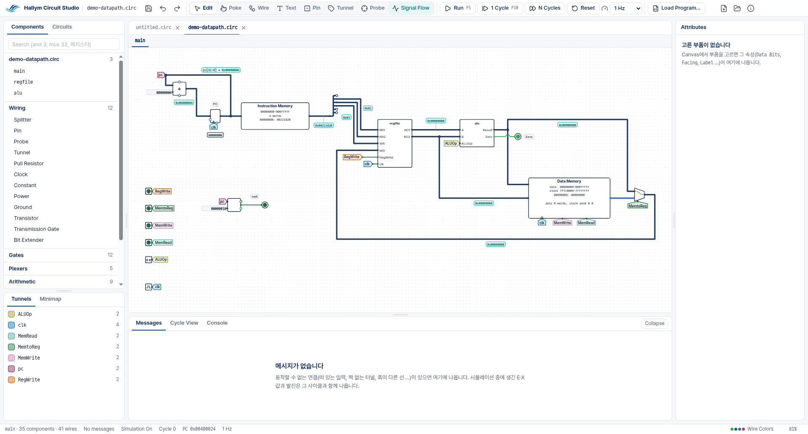
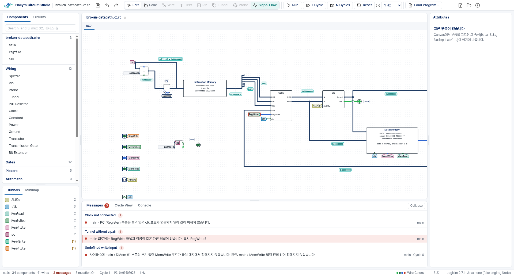
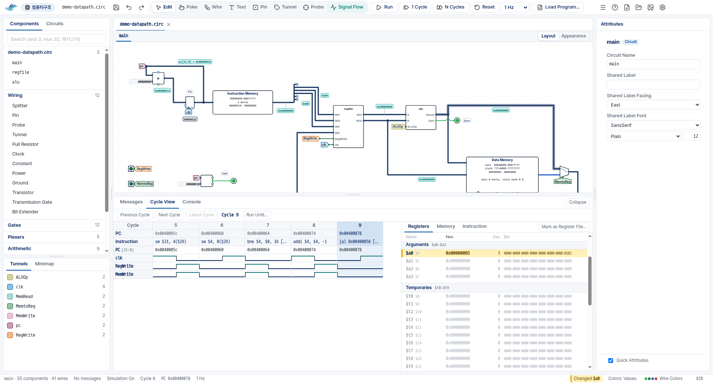
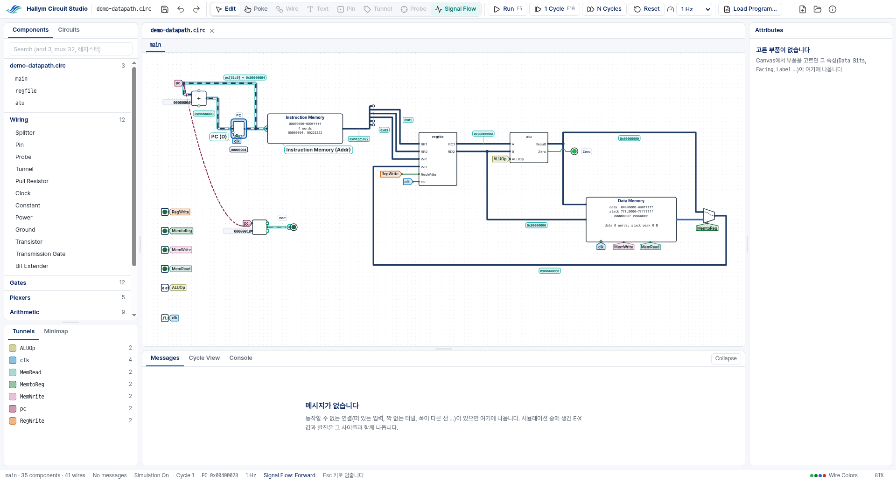
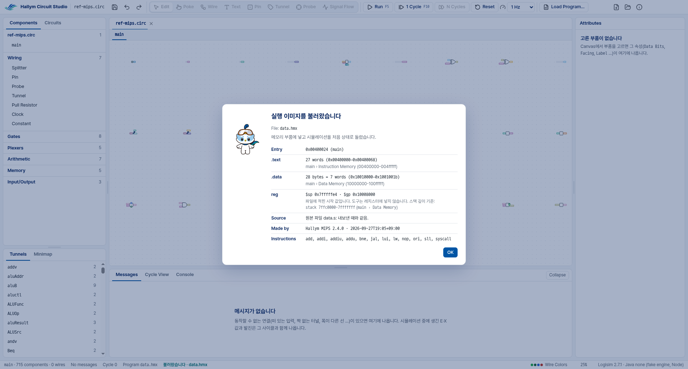
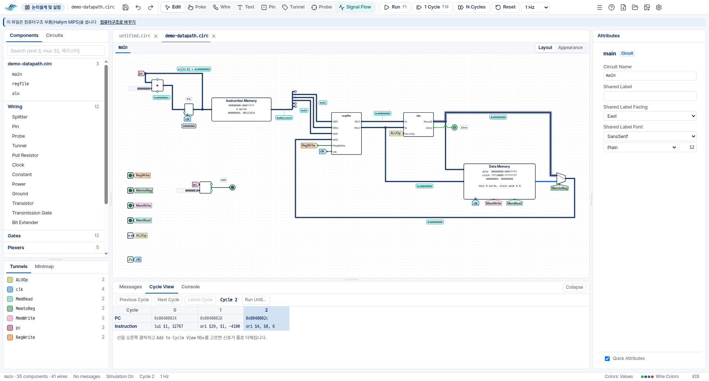
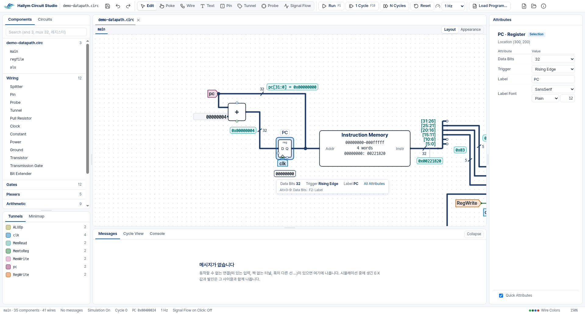
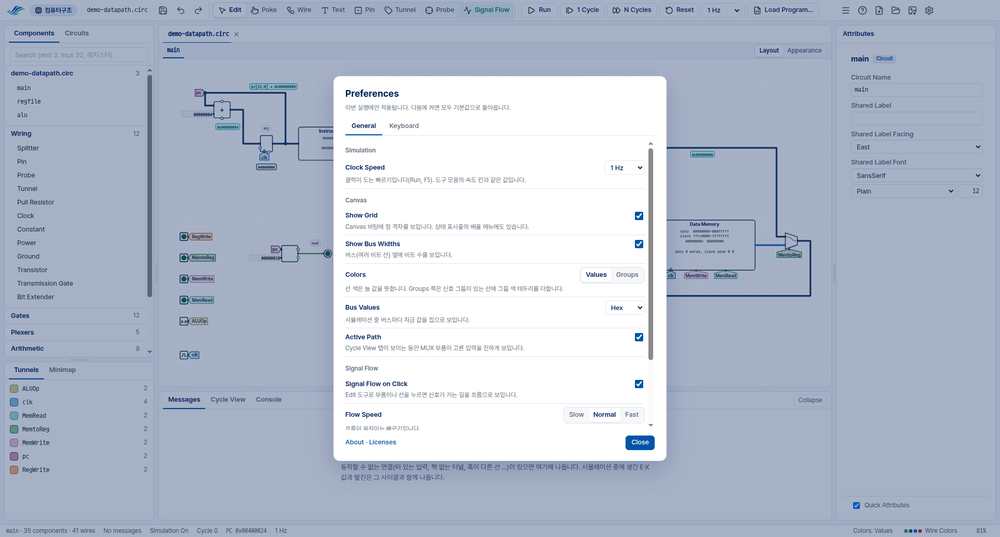

# Hallym Circuit Studio

> **사용법 (한국어): [docs/GUIDE-ko.md](docs/GUIDE-ko.md)** — 내려받기, 설치,
> Windows 경고 창 넘기기, 첫 실행과 튜토리얼, 자주 막히는 곳.

A circuit editor and simulator for the logic design and computer architecture
courses of Hallym University, built on **Logisim 2.7.1**. It runs the original
Logisim 2.7.1 simulation engine unchanged and puts a new window on top of it.
Students draw circuits, from gates and wires up to a single-cycle MIPS
datapath, run them one clock cycle at a time, and see where a circuit cannot
work — named with the names they gave it.

**Version 2.x — an Electron window with a Java engine that runs Logisim 2.7.1
— is the current version.** Until 2.0.0 it comes out as pre-releases
(`v2.0.0-alpha.N`). Version 1.x — the Swing edition — is the previous one; its
last release is [1.0.3](https://github.com/ars2323/hallym-circuit-studio/releases/tag/v1.0.3),
and its source is at the tag `v1.0.3`.



## What's different

Compared with original Logisim 2.7.1, this is what a student sees differently.
The simulation itself is Logisim's own.

**Same files, same results** — an existing `.circ` assignment opens as it is
and simulates the same way. Editing is done by the engine with Logisim's own
editing code, so a file that uses no new parts is saved byte for byte as
original 2.7.1 saves it, and still opens there.

**Messages** — only a circuit that cannot work is reported: a floating input,
an E or X value, oscillation, a width conflict, a tunnel without a pair. Each
message names one cause, in the names the student gave, with its place. A
circuit that works but gives a wrong answer is not judged.



**Cycle View and Registers** — every cycle is recorded: the program counter,
the instruction and any signal the student adds, cycle by cycle, with the step
back to an earlier cycle; the MIPS registers in hex, decimal and binary at once.



**Signal Flow** — click a part or a wire and the way its signal goes is drawn
over the circuit.



**Hallym MIPS parts and `.hmx`** — MIPS parts that use real 32-bit addresses
(Instruction Memory, Data Memory with data and stack, Console, Radix Probe)
and Load Program…, which loads the executable image (`.hmx`) that
[Hallym MIPS Simulator](https://github.com/ars2323/hallym-mips-simulator)
exports. The machine code is loaded as it is; the tool does not assemble or
re-encode it.



**Course selection** — at every start the start card asks for the course:
논리설계 및 실험 (the logic design course) or 컴퓨터구조 (the computer
architecture course). The logic design course hides the MIPS-only parts and
features; a file that uses them still opens and runs, with a band that offers
[컴퓨터구조로 바꾸기] ("Switch to the computer architecture course").



**Attributes and Quick Attributes** — the selected part's attributes in a
panel, with the original names and values, and a small bar with the ones used
most, placed where it covers no part, wire or chip.



**The lab PC rule** — nothing is remembered between runs: every start is the
same screen, settings apply to this run only, and the app writes nothing
outside the student's own files (checked on Windows in CI).



## Download

**[Latest release](https://github.com/ars2323/hallym-circuit-studio/releases/latest)**
(Windows 64-bit): one file, `HallymCircuitStudio-<version>-win-x64-setup.exe`.
It installs for the current user only (no administrator rights, no Java) and
adds a Start menu entry. Pre-releases of 2.x are on the
[releases page](https://github.com/ars2323/hallym-circuit-studio/releases).

The program is not code-signed, so Windows SmartScreen warns the first time it
runs. Choose **More info → Run anyway** (on Korean Windows: **추가 정보 →
실행**); the user guide ([한국어](docs/GUIDE-ko.md#1-설치)) shows the steps.
The notes of each release list the files' SHA-256.

For original Logisim 2.7.1, the MIPS parts are also released on their own as
`hcs-mips.jar` (track A, below).

## Two tracks

| | Track A: MIPS part library | Track B: Hallym Circuit Studio |
| --- | --- | --- |
| What | `hcs-mips.jar`, a JAR library for original Logisim 2.7.1 | This app (Electron window + Java engine) |
| Download | `hcs-mips.jar` or `hcs-mips-<version>-windows.zip` | the setup exe |
| Use | Project › Load Library › JAR Library ([docs/track-a-guide.md](docs/track-a-guide.md)) | always in the parts list under **Hallym MIPS** |

Both tracks use the same part code (`lib-mips`), so one `.circ` opens in both.
A file that uses Hallym MIPS parts needs `hcs-mips.jar` next to it to open in
original 2.7.1.

## Repository layout

```text
electron/               the window: Electron main and renderer (TypeScript), tests, tools, installer settings, screenshots
  src/renderer/shared/  screen parts taken from Hallym MIPS (sources in electron/ORIGIN.md)
engine/                 the Java engine server: headless Logisim 2.7.1, JSON-RPC over stdio (docs/engine-api.md)
app/                    the Logisim 2.7.1 fork source and the GUI-less code the engine uses
lib-mips/               track A: the MIPS part JAR library (for original 2.7.1; the engine uses it too)
vendor/logisim-2.7.1/   the original Logisim 2.7.1 jar, unmodified (checked by tools/verify-vendor.sh)
assets/                 fonts and files derived from the university's marks
tests/                  engine regression, edit-parity goldens, executable images (.hmx), diagnostic inputs
docs/                   decisions, progress, the engine protocol, research and design notes
tools/                  repository checks (vendor, assets, engine unchanged) and track A packaging
```

## Building

A JDK is fetched by the Gradle wrapper (toolchains, JDK 21); Node.js 22.18 or
later.

```sh
./gradlew :engine:stage          # the engine jar (engine/build/stage/hcs-engine.jar) and hcs-mips.jar
./gradlew test                   # Java unit tests, engine regression, edit parity
cd electron
npm ci
npm run electron                 # run the app (uses the engine from the source tree; java from JAVA_HOME or PATH)
npm test                         # window unit tests
xvfb-run -a npm run e2e          # Playwright e2e (Xvfb on Linux)
```

The Windows installer is built on Windows: `./gradlew :engine:stage
:engine:runtime`, then `node tools/package.ts` in `electron/`. The release
steps are in [docs/release.md](docs/release.md), all the tests in
[docs/TESTING.md](docs/TESTING.md).

### Continuous integration

One workflow (`ci.yml`). A pull request is gated by the Linux jobs (build,
Java tests, engine regression, window unit and e2e tests, the bundled runtime
with the real engine, track A on Java 8, the release file rules); the Windows
jobs (the installer, installing, upgrading and uninstalling it, and checking
that nothing is left on the PC) run on `main`, on tags, and on pull requests
that touch packaging or Windows-only code.

## License

This project is under the GNU General Public License, version 2 or later, as
Logisim 2.7.1 is ([`LICENSE`](LICENSE)); Logisim's original author is Carl
Burch. The window code taken from Hallym MIPS Simulator is under the BSD
3-Clause License. No SPIM code is included: Hallym MIPS assembles, and only
output SPIM produced is kept as test data. [`NOTICE`](NOTICE) lists every
third-party component.

The Hallym University marks, the characters Haram and Hari, and the
university's promotional video on the first screen belong to Hallym
University. They are not covered by this project's license, may not be used
commercially, and may not be taken from here and used elsewhere (see
[`NOTICE`](NOTICE)).

Developed by Hakhyeon Kim, AIAC Lab, Hallym University, as a personal
project. This is not an official product of Hallym University.
